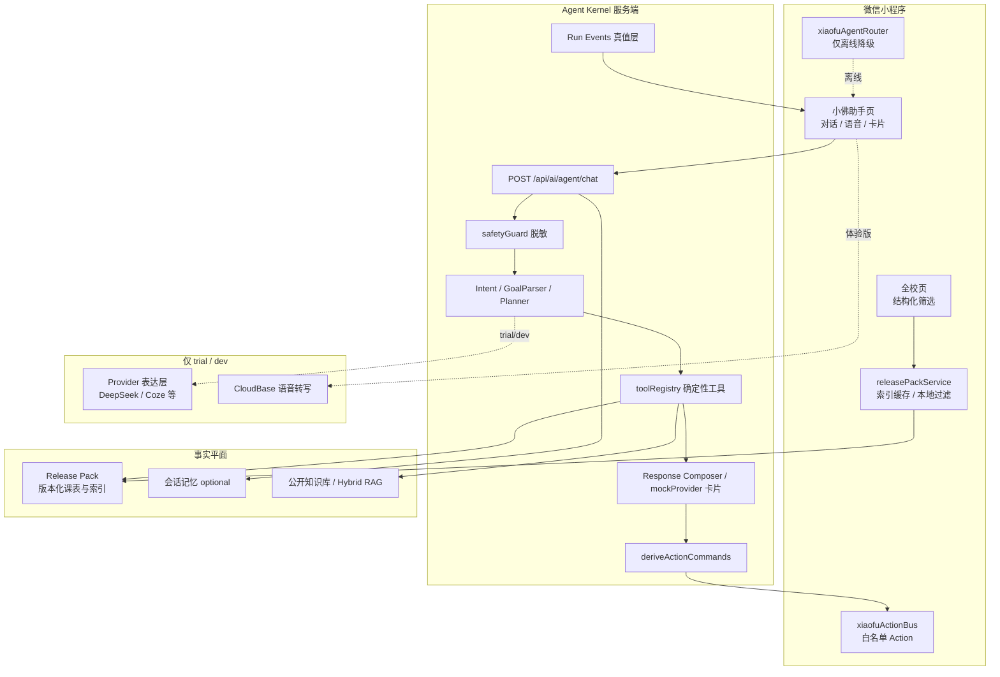

# 小佛助手（FosuClass）智能体设计说明书

| 字段 | 内容 |
|------|------|
| 作品名称 | 佛课小表 · 小佛助手（FosuClass Xiaofu Agent） |
| 形态 | 原生微信小程序 + Node.js 服务端 Agent Kernel + Release Pack 确定性数据平面 |
| 面向对象 | 佛山大学师生（以学生课表与校园任务为主） |
| 程序交付 | 完整可编译源码（非低代码平台导出） |
| 文档版本 | 2026-07 · 与 `main` 教师检索合同 / Schedule Navigation / 结果卡可点开 对齐 |
| 关联演示脚本 | `docs/demo-script-5min.md` |

---

## 目录

1. [设计思路](#1-设计思路)
2. [系统架构](#2-系统架构)
3. [功能模块](#3-功能模块)
4. [算法与关键机制](#4-算法与关键机制)
5. [数据与事实平面](#5-数据与事实平面)
6. [人机交互与产品体验](#6-人机交互与产品体验)
7. [安全、隐私与运行模式](#7-安全隐私与运行模式)
8. [工程化与质量保障](#8-工程化与质量保障)
9. [创新点与竞争力](#9-创新点与竞争力)
10. [与参赛材料要求对照](#10-与参赛材料要求对照)
11. [验收路径与演示建议](#11-验收路径与演示建议)
12. [术语表与代码索引](#12-术语表与代码索引)

---

## 1. 设计思路

### 1.1 问题定义

高校学生的高频校园任务具有典型特征：**事实必须准确、入口却极度分散**。

| 痛点 | 传统小程序表现 | 后果 |
|------|----------------|------|
| 入口分散 | 班级 / 教师 / 教室 / 空教室 / 个人课表分属多页多筛选 | 新生不会用、任务路径长 |
| 筛选门槛高 | 学院、专业、年级、节次、楼栋参数多 | 查一位老师要多次试错 |
| 事实可信度 | 若直接用大模型“回答课表”，易编造节次教室 | 误课、投诉风险 |
| 隐私敏感 | 学号密码、完整个人课表若进模型上下文 | 合规与信任问题 |
| 可演示性 | 依赖外部 API Key 才能跑通 | 比赛/正式版验收不稳 |

小佛助手要解决的核心不是“更会聊天”，而是：**用自然语言或结构化筛选，把校园任务可靠地执行完，并让结果可点、可核查、可降级**。

### 1.2 目标用户与场景

- **主用户**：在校学生（查课、找空教室、看今日安排、导入个人课表）。
- **次用户**：需要查教师/教室占用的师生。
- **评委/验收**：体验版小程序 + public 正式路径可零密钥演示。

**典型任务句**

- 「查看陈芳老师的课表」→ 识别教师实体 → 检索 → **卡片点选打开教师课表**
- 全校页：院系=动物科技学院，关键词「丽梅」→ 列表命中 → 点开课表
- 「现在 C 区有没有空教室」→ 空教室工具 → 卡片 + 跳转空教室页
- 「今天有什么课」→ 个人课表摘要工具（需本机导入，不收集学号密码）

### 1.3 核心设计原则

| 原则 | 含义 | 落地约束 |
|------|------|----------|
| **工具优先 / 事实可核查** | 课表、教师、空教室只来自 Release Pack 与确定性工具 | 模型不得补全或改写课表字段 |
| **public 零外部模型** | 正式版不调用任何外部 LLM/Provider | 保证可演示、可验收、无密钥依赖 |
| **数据最小化** | Provider 仅收脱敏消息与裁剪后的工具结果 | 禁止学号/密码/Cookie/Token/完整个人课表入模 |
| **体验与安全同构** | trial/dev 可开表达层，但 Intent/Skill/Tool/Action 边界与 public 相同 | 禁止“体验版绕过安全” |
| **可降级** | 网络失败、Provider 失败、索引旧版本 | last-known-good；保留确定性结果 |
| **双入口一致** | 自然语言助手与全校结构化页共用同一检索合同 | 同一 `q` + `collegeCode` 命中集合一致 |
| **可执行闭环** | 结果不是纯文案，而是卡片 + 白名单导航 | Search → Evidence → 打开课表 |

### 1.4 产品定位

**小佛助手** = 嵌入「佛课小表」微信小程序的**校园任务型 Agent**：

```text
用户目标（自然语言 / 结构化筛选）
        ↓
   Intent / Planner（受约束）
        ↓
   确定性 Tool（Release Pack）
        ↓
   Response Composer（答案 + 卡片 + Action）
        ↓
   客户端 Action Bus（白名单页面跳转）
        ↓
   schedule-view / 空教室 / 全校页 …
```

它与通用聊天机器人的本质差异：**任务闭环 + 事实平面隔离 + 正式版可无模型运行**。

---

## 2. 系统架构

### 2.1 总体架构



### 2.2 分层说明

| 层级 | 职责 | 关键路径 |
|------|------|----------|
| **表现层** | 对话 UI、结果卡、全校筛选、课表视图 | `miniprogram/packageXiaofu/`、`pages/school/`、`pages/schedule-view/` |
| **客户端服务** | 索引缓存、本地过滤、导航、Action 执行 | `releasePackService.js`、`scheduleNavigationService`、`xiaofuActionBus` |
| **Agent Kernel** | 意图、规划、工具、组合、安全、Run Events | `server/src/services/ai/` |
| **事实平面** | Release Pack 发布、索引、详情、空教室 | `releaseService`、静态 Pack、版本校验 |
| **可选表达层** | trial/dev 润色、语音 ASR | Provider 适配器、CloudBase 云函数 |

### 2.3 关键决策：服务端 Kernel 唯一

- **在线决策核心**只在服务端 Agent Kernel。
- 小程序 `xiaofuAgentRouter` **仅**负责离线/弱网降级，禁止发展成平行在线 Agent。
- 能力权威源：`server/config/agent-capability-manifest.json`；客户端兼容表由 `tools/generate-agent-capability-compat.js` **生成**，禁止手工维护第二份 Intent/Skill/Tool 清单。

### 2.4 协议与版本

- 对外对话协议以 `agent.v1` 向后兼容；增强字段进入 `agent.v2`。
- 禁止向客户端泄露：系统提示、隐藏推理、内部 URL、Provider 密钥、完整个人课表原文。
- Loading / Thinking 状态必须来自服务端 **真实 Run Events**，客户端不得猜测“正在查询课表”。

### 2.5 部署拓扑（交付可运行）

```text
微信小程序（体验版 / 正式版）
        │ HTTPS
        ▼
API 网关 / OpenResty（可选静态 Pack 回源）
        │
        ▼
VPS 容器（Node API，GHCR 镜像）  ← GitHub Actions Deploy
        │
        ├── Release Pack 存储 / 缓存
        ├── 会话记忆（可选 cloud_sync）
        └── CloudBase（语音等可选能力）
```

---

## 3. 功能模块

### 3.1 模块总览

| 模块 | 用户可见能力 | 内核能力 |
|------|--------------|----------|
| M1 自然语言任务 | 对话查课 / 空教室 / 今日安排 | Intent → Tool → Card → Action |
| M2 全校结构化查询 | 班级 / 教师 / 教室 / 课程 Tab | 与 Agent 共用索引与过滤合同 |
| M3 课表浏览与导航 | schedule-view、设为首页课表 | Schedule Navigation + 确认写操作 |
| M4 个人课表 | XLS 导入、本机摘要 | 最小字段；不进模型明文 |
| M5 空教室 | 节次 / 楼栋 / 连续节 | `search_empty_rooms` 等工具 |
| M6 公开知识 | 校园 FAQ 类问答 | Hybrid RAG（禁止向量化课表事实） |
| M7 语音（体验） | 麦克风 → 转写 → 填框 | 隐私与权限状态机；不自动发送 |
| M8 会话记忆 | local_only / 可选 cloud_sync | Principal 仅来自已验证 Session |

### 3.2 M1：自然语言任务（小佛助手）

**输入**：用户文本（或语音转写后的文本）。  
**输出**：中文答复 + 结果卡 + 建议追问 + 可选 Action Command。

**教师课表主路径（重点）**

1. GoalParser / 规则意图识别：`open_schedule` 或 `search_school_index`，`entityType=teacher`。
2. 查询串归一化：`陈芳老师的课表` → **`q=陈芳`**（剥离「老师/教师」等称谓）。
3. 工具 `search_school_index({ type: teacher, q })` 读 Release Pack 教师索引。
4. **唯一命中**：主按钮「打开教师课表」→ `/pages/schedule-view/schedule-view`。
5. **多命中**：列表卡片每行可点；前若干候选提供「打开××」按钮；保留「打开全校查询」。
6. **零命中**：中文空结果说明 + 引导全校页，**不伪造**命中。

### 3.3 M2：全校页 · 教师栏目（重点）

用户期望的交互（本作品目标体验）：

```text
进入「全校」→「教师」
    ├─ 院系：默认「所有院系」→ 输入姓名关键词 → 搜索 → 全校匹配列表
    └─ 院系：选「动物科技学院」等具体院系 → 关键词 → 仅该院系内匹配
点选教师 → schedule-view 打开课表
```

**状态隔离（重要工程点）**

| 状态字段 | 班级 Tab | 教师 Tab |
|----------|----------|----------|
| 学院列表 | `colleges`（真实学院，无合成项） | `teacherColleges` = `[{所有院系}, ...colleges]` |
| 选中下标 | `selectedCollegeIndex` 默认 **-1**（必须选学院） | `selectedTeacherCollegeIndex` 默认 **0**（所有院系） |
| 变更回调 | `onCollegeChange` | `onTeacherCollegeChange`（有关键词时自动重搜） |

班级与教师**不得**共用带「所有院系」的列表，否则会破坏班级「未选学院」语义。

### 3.4 M3：课表导航

- 统一服务：`scheduleNavigationService` / 服务端 `buildScheduleNavigateAction`。
- 参数：`type, id|detailId, name, term, releaseVersion`。
- **禁止**通过 URL 传递完整 `courses[]` 数组。
- 写操作（设为首页课表）必须用户确认 + Receipt，禁止静默成功。

### 3.5 M7：语音权限状态机（摘要）

顺序：隐私同意 → `scope.record` → RecorderManager → 系统麦克风 → ASR。

| reasonCode | 含义 | UI 动作 |
|------------|------|---------|
| PRIVACY_NOT_ACCEPTED | 未同意隐私 | 引导隐私指引 |
| WECHAT_RECORD_UNDECIDED | 未决定 | 可再次 authorize |
| WECHAT_RECORD_DENIED | 已拒绝 | 打开设置 |
| SYSTEM_MIC_DENIED | 系统禁止 | 系统设置 |
| ASR_FAILED / ASR_NOT_ENABLED | 识别侧 | 与权限错误分离展示 |

转写结果**只填入输入框，不自动发送**，用户可校对。

---

## 4. 算法与关键机制

### 4.1 请求处理流水线

```text
POST /api/ai/agent/chat
  1. 鉴权 / runtimeMode（public|trial|dev）
  2. safetyGuard：脱敏、注入与越权拦截
  3. 解析 Intent / Goal（规则优先；trial 可模型规划且失败回退）
  4. 槽位检查 → 缺槽则 clarify_missing_slot
  5. 执行 Tool（确定性，最多 Observation→Verify→Replan 1 次）
  6. Response Composer：answer + cards + suggestions
  7. deriveActionCommands：由工具结果确定性派生导航/写操作
  8. 记录 Run Events；返回 agent.v1/v2 公共字段
```

**禁止**：伪造 Thinking；在未真实调用 Provider 时展示 Thinking；用模型结果覆盖工具事实。

### 4.2 意图识别与目标规划

1. **规则 / GoalParser**：识别 `open_schedule`、空教室、今日课、天气等目标与实体类型。
2. **槽位**：教师名、教室、节次等；不足则澄清（如「你想查哪位老师？」）。
3. **PendingClarification**：跨轮补全短回复（用户只回「陈芳」）。
4. **public**：确定性计划；**trial/dev**：可选模型规划，失败必须回退确定性路径。

### 4.3 教师姓名归一化（Honorific Strip）

问题：用户常说「陈芳**老师**的课表」，若整串做精确姓名匹配会 **0 命中**。

算法（`stripPersonHonorifics`）：

```text
输入原文
  → 去空白
  → 去掉尾部「的课表/课程表」
  → 去掉尾部「老师/教师/教授/讲师/导师」等
  → 去掉前缀「老师/教师」
输出：纯姓名关键词（如「陈芳」）
```

类型锁定为 teacher 后，**检索 q 必须走剥离后的姓名**；类型推断阶段可暂留「老师」字样以帮助识别实体类型。

### 4.4 Teacher Search Contract（教师检索合同）

Agent 工具链与全校页客户端**共用同一语义**：

```text
输入:
  type = teacher
  q                # 姓名关键词（已归一化）
  collegeCode?     # 空 = 所有院系
  collegeName?     # 与 code 可互补
  term, releaseVersion, schemaVersion

处理:
  1. 加载完整 teachers index（禁止把「单次搜索结果」写成全量缓存）
  2. 学院过滤:
       - 无 code 且无 name → 全校通过
       - 有过滤条件 → code 命中 OR name 命中（容忍编码与名称源漂移）
       - 「学院待确认」且无 codes 时，在过滤开启下排除
  3. 关键词:
       - 精确姓名优先；存在精确命中时不返回模糊噪声
       - 否则子串模糊（normalized）
  4. 分页 limit/offset

输出:
  items[]: id/detailId, teacherName, collegeCode(s), collegeName(s), courseCount, term, releaseVersion
  total, debug（可选，不入模型明文密钥）
```

**反例（已修）**：曾把「只搜到陈芳」的结果列表误写入全量教师索引缓存，导致全校页只剩陈芳可搜。现缓存键含 schema 纪元，且**过滤结果不得覆盖全量 index**。

**学院 + 关键词路径**：学院过滤激活时优先服务端检索，空结果再回退本地完整索引过滤；空的「教师+学院」查询不写死缓存。

### 4.5 Schedule Navigation 与 Action 派生

`deriveActionCommands` **不由模型生成**，只读工具成功结果：

| 工具结果 | 派生 Action |
|----------|-------------|
| `search_school_index` 唯一命中 | `navigate` → schedule-view（打开×课表） |
| 多命中 | 前 3 个候选各自打开 + 「打开全校查询」 |
| `get_schedule_detail` 成功 | 打开对应课表 |
| `set_current_schedule` 合法 | 需确认的 `setCurrentSchedule` |

客户端 `xiaofuActionBus` 校验白名单页面，拒绝任意 URL。

### 4.6 结果卡组合算法（Composer）

public / mock 路径以 `mockProvider.buildSchoolIndex` 为代表：

| 命中数 | 卡片策略 |
|--------|----------|
| 0 | 空结果文案 + 「打开全校查询」 |
| 1 | 标题含教师名；主按钮「打开教师课表」；行内带 schedule-view URL |
| >1 | 列表展示学院与门数；**每行可点**打开；提供前若干「打开××」按钮 |

客户端 `normalizeCardItem` 识别 `url` → `tappable`；`xiaofu-result-card` 行点击 `itemtap` → `navigateByUrl`。

### 4.7 Hybrid RAG（公开知识）

- 仅覆盖**公开知识**，禁止将课表事实向量化。
- Embedding 不可用时自动 **Lexical 退化**。
- 联网检索结果只能生成候选草稿，禁止直接发布入库。

### 4.8 Observation 循环边界

- Observation → Verify → Replan **最多 1 次**。
- 不得为了“显得更智能”而无限工具循环或伪造中间态。

---

## 5. 数据与事实平面

### 5.1 Release Pack

全校班级 / 教师 / 教室 / 课程索引与详情以 **版本化 Release Pack** 发布：

- 版本校验、静态源回退、缓存、last-known-good。
- 网络或新数据加载失败时**必须保留**上一份可用数据。
- 教师索引 Schema v3+：`id/detailId`、`teacherName`、`normalizedName`、`collegeCode(s)`、`collegeName(s)`、`courseCount`、`term`、`releaseVersion`；学院关系由课表课程派生。

### 5.2 个人课表

- 用户通过 XLS / 个人同步导入本机。
- Agent 仅在用户开启摘要后读取**最小必要字段**做今日/提醒类任务。
- **不收集、不上传学号密码**作为 Agent 登录手段。

### 5.3 生成式模型的边界

```text
允许：表达润色、任务编排建议、公开知识问答润色（trial/dev）
禁止：编造课表节次/教室/教师归属；改写工具返回的事实字段；在 public 调用外部模型
```

---

## 6. 人机交互与产品体验

### 6.1 对话页几何

- 页面为 flex 列布局：消息区滚动 + 底部输入框**文档流内**底栏。
- 禁止 absolute 大面积空白叠盖对话内容。
- 安全区：`env(safe-area-inset-bottom)`。

### 6.2 结果呈现层级

- 普通闲聊：不堆 Evidence、不乱出通用「小佛助手」卡。
- 事实任务：卡片优先，主按钮 ≤2 个显式动作；多教师时行可点补充。
- 失败：中文映射，不泄漏内部 tool 名。

### 6.3 全校教师检索体验清单

1. 院系可选「所有院系」或具体学院。  
2. 关键词支持姓名片段（如「丽梅」「芳」）。  
3. 切换院系且已有关键词时**自动重搜**。  
4. 结果列表点选进入教师课表。  
5. 与小佛助手对同一教师的命中一致（合同一致）。

---

## 7. 安全、隐私与运行模式

### 7.1 运行模式

| 模式 | 外部模型 | 用途 |
|------|----------|------|
| **public** | **调用次数 = 0** | 正式版 / 比赛默认演示 |
| trial | 可配置 | 体验版表达增强，失败回退确定性 |
| dev | 可配置 | 开发调试 |

兼容配置名 `competition` 只映射为规范运行模式，不扩展独立业务语义。

### 7.2 隐私红线

以下内容**不得**进入模型、Trace、普通日志、文档或测试快照：

学号、密码、Cookie、Authorization、API Key、Token、登录票据、原始个人文件、XLS 原文、文件 base64。

### 7.3 后台与知识库高风险操作

publish / rollback / 批量删除 / 修改 public 范围 / Tool·Intent 绑定：必须人工确认、细粒度 scope、审计、幂等与回滚。即使未来经 MCP 暴露，亦不可直连无鉴权写路径。

### 7.4 会话记忆

- 服务端不信任客户端 `conversationId` 作为用户身份；Principal 仅由已验证 Session 派生。
- 默认 `local_only`；`cloud_sync` 须用户显式开启。
- 无有效 Session 不得假装云端同步成功。

---

## 8. 工程化与质量保障

### 8.1 技术栈

| 层级 | 技术 |
|------|------|
| 客户端 | 原生微信小程序（主包 + packageXiaofu / packageMaps） |
| 服务端 | Node.js Express 模块化单体 |
| 数据 | Release Pack 静态索引 + 受控 API |
| 语音 | 微信录音 + CloudBase ASR（体验版） |
| CI/CD | GitHub Actions → GHCR → VPS Deploy |

### 8.2 能力清单生成链

```text
agent-capability-manifest.json
        ↓ generate-agent-capability-compat.js
客户端兼容映射 / 工具 schema 生成物
```

禁止双份手工清单漂移。

### 8.3 测试门禁（与教师检索相关摘录）

| 命令 / 脚本 | 覆盖 |
|-------------|------|
| `npm run test:teacher-college-keyword` | 学院+关键词、所有院系、称谓剥离、卡片可点、班级隔离 |
| `tools/test-teacher-index-cache-no-poison.js` | 缓存不得被单次搜索污染 |
| `npm run test:xiaofu-core-experience` | UI 几何、语音 reasonCode、导航等 |
| `npm run test:agent-foundation` 等 | Agent 回归与收敛门禁（改 Agent 时必跑） |

### 8.4 仓库结构（交付阅读）

```text
miniprogram/          小程序（含小佛助手分包、全校页、课表）
server/               API + Agent Kernel
server/config/        能力清单等权威配置
tools/                生成脚本与测试
docs/                 设计说明书、演示脚本、架构说明
AGENTS.md             自动化开发与安全约束
```

---

## 9. 创新点与竞争力

| 维度 | 本作品做法 | 对比常见「校园 AI 聊天」 |
|------|------------|-------------------------|
| 事实可信 | Release Pack + 确定性工具，模型非事实源 | 易幻觉课表 |
| 任务闭环 | 检索 → 卡片 → **一点打开课表** | 停在文字回复 |
| 双入口一致 | 全校筛选与 Agent 同一 Teacher Search Contract | 两套逻辑不一致 |
| 正式版可验收 | public 零外部模型 | 无 Key 无法演示 |
| 工程完整 | 能力清单单源、缓存防污染、CI 部署、Run Events 真值 | 演示型脚本难维护 |
| 隐私 | 最小化、权限 reasonCode 可诊断 | 权限失败黑盒 |

**一句话差异化**：小佛助手是「可信校园任务 Agent」，不是课表聊天机器人。

---

## 10. 与参赛材料要求对照

| 赛题要求 | 本作品交付 |
|----------|------------|
| ① 智能体设计说明书 | **本文档**（设计思路、架构、模块、算法） |
| ② 演示视频 ≤5 分钟 | 脚本见 `docs/demo-script-5min.md`；体验版可供评委试用 |
| ③(a) 代码开发完整源码 | GitHub 仓库；可编译运行；含注释与文档 |
| ③(b) 低代码 | **不适用**（本作品为传统代码开发） |
| 可选在线演示 | 微信小程序体验版权限 |

---

## 11. 验收路径与演示建议

### 11.1 功能验收（评委可跟做）

1. **小佛助手**：输入「查看陈芳老师的课表」→ 卡片展示陈芳 → 点「打开教师课表」进入 schedule-view。  
2. **多关键词**：输入较短姓氏片段时，多命中列表**可逐行点开**。  
3. **全校 · 教师**：  
   - 院系=所有院系，关键词任意姓名片段 → 有结果；  
   - 院系=具体学院（如动物科技学院）+ 该院教师关键词 → 有结果；  
   - 换不含该教师的学院 → 无结果。  
4. **班级 Tab**：学院默认「选择学院」，未选全条件时查询按钮保持禁用（与教师「所有院系」隔离）。  
5. **public**：无外部大模型调用仍可完成 1–3。

### 11.2 五分钟演示结构（摘要）

详见 `docs/demo-script-5min.md`：痛点 → 助手打开教师课表 → 全校学院筛选对照 → 空教室/今日 → 安全边界 → 三句收口。

### 11.3 录制前检查

- 体验版已登录，课表/索引可加载  
- 能搜到多名教师（确认无缓存污染）  
- 「打开教师课表」按钮或行点击可用  
- 关闭无关系统通知  

---

## 12. 术语表与代码索引

### 12.1 术语

| 术语 | 含义 |
|------|------|
| Release Pack | 版本化发布的课表与索引数据包 |
| Teacher Search Contract | 教师检索的统一输入输出与过滤语义 |
| Action Bus | 客户端白名单命令执行总线 |
| Run Events | 服务端真实运行事件流（Loading/Thinking 真值） |
| public / trial / dev | 运行模式；public 禁止外部模型 |

### 12.2 关键代码索引（便于评审阅读源码）

| 主题 | 路径 |
|------|------|
| 能力清单 | `server/config/agent-capability-manifest.json` |
| 工具注册与称谓剥离 | `server/src/services/ai/toolRegistry.js` |
| Action 派生 | `server/src/services/ai/agentService.js` → `deriveActionCommands` |
| 结果卡文案与打开链接 | `server/src/services/ai/providers/mockProvider.js` → `buildSchoolIndex` |
| 服务端学院匹配 | `server/src/services/releaseService.js` |
| 客户端过滤与防污染 | `miniprogram/services/releasePackService.js` |
| 全校教师 UI 状态 | `miniprogram/pages/school/school.js` |
| 结果卡行点击 | `miniprogram/packageXiaofu/components/xiaofu-result-card/` |
| Action 白名单 | `miniprogram/packageXiaofu/services/xiaofuActionBus.js` |
| 工程约束 | `AGENTS.md` |

---

## 附录 A · 教师课表用户旅程（产品视角）

```text
【路径 A · 结构化】
全校 → 教师 → 选院系（所有院系/某学院）→ 输入关键词 → 搜索
  → 列表 → 点教师 → schedule-view

【路径 B · 自然语言】
小佛助手 → 「查陈芳老师课表」→ 归一化 q=陈芳 → search_school_index
  → 结果卡（唯一：主按钮打开；多命中：行可点）
  → schedule-view

【一致性】
A/B 对同一 q + college 的命中集合遵循同一 Teacher Search Contract。
```

## 附录 B · 非目标（本说明书范围外）

- 不将 LangChain/LangGraph/向量库替换现有轻量内核（除非专项评审授权）
- 不把模型当课表事实源
- 不收集学号密码完成 Agent 登录
- 不在 public 引入外部 Provider

---

*本文档为竞赛「智能体设计说明书」主文档。演示分镜见 `docs/demo-script-5min.md`。实现以 Git 仓库 `main` 分支源码为准。*
