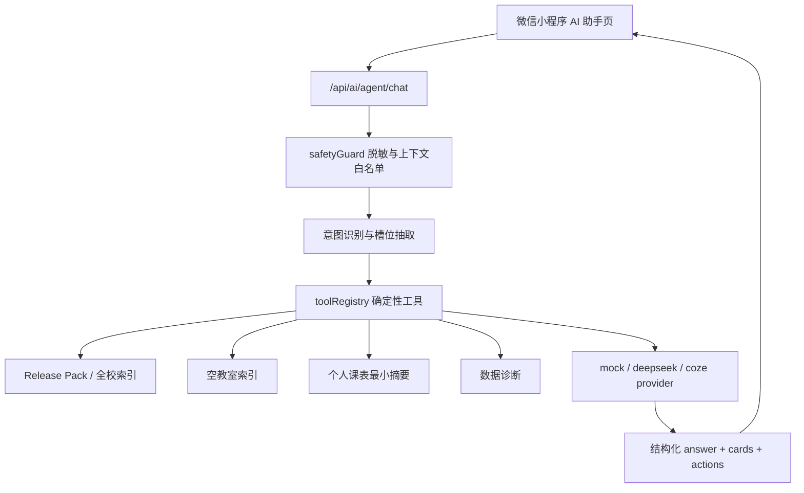

# 2026 智能体应用创新大赛方案：佛课小表 AI 校园管家

## 赛道

2-E 数智生活：综合服务智能体开发 / 校园服务。

## 作品定位

《佛课小表·AI校园管家》面向佛山大学学生的课程与空间服务智能体。它不是把大模型当成教务事实来源，而是在现有课表、Release Pack、全校索引、空教室索引和个人 XLS 课表摘要之上，新增自然语言任务层，让学生用一句话完成“查课、找教室、看今日安排、推荐自习时间、排查数据问题”等高频校园任务。

## 真实场景痛点

- 学生知道自己想做什么，但不一定知道应该打开“全校”“今日”“空教室”还是“个人同步”。
- 教师、课程、教室、班级数据分散在不同入口，检索路径对新用户不友好。
- 空教室查询需要理解日期、节次、楼栋和连续空闲条件，用户自然语言表达与筛选项存在距离。
- 数据加载失败时，普通用户很难判断是网络慢、Release Pack 缺失、缓存旧版本还是未发布。
- 个人课表涉及学号密码等敏感信息，需要明确的安全边界和 XLS 优先导入路径。

## 系统架构图

## 智能体工作流

1. 理解需求：用规则优先识别“空教室、今日课程、教师/教室/课程查询、导入指引、数据诊断、组会时间”等意图。
2. 槽位补全：从自然语言中抽取楼栋、节次、日期、连续空闲数量、查询类型和关键词。
3. 工具调用：优先调用 `releaseService.searchActiveIndex`、`readActiveSchedule`、`queryEmptyClassrooms`、Release Pack health 和个人课表摘要算法。
4. 结果卡片：把工具结果转成 `empty_room`、`schedule`、`teacher`、`course`、`diagnosis`、`guide`、`reminder` 等稳定卡片。
5. 一键操作：卡片 action 导航到空教室、全校查询、今日课程、课表详情或 XLS 导入页面。

## 功能模块

- AI 校园管家页面：快捷问题、聊天输入、结构化卡片、后续建议、本地最近 20 条对话。
- 后端 Agent：`/api/ai/agent/chat`、安全守卫、工具注册、Provider 工厂、mock 降级。
- 空教室工具：支持“现在”“今天下午”“连续两节”“C7 附近”等自然语言映射。
- 今日课程工具：基于小程序端最小化课表摘要分析当天课程和下一节课。
- 全校索引工具：复用教师、教室、课程、班级 Release Pack 索引。
- 数据诊断工具：汇总 active release、索引数量、Release Pack 健康状态和缓存建议。
- 个人导入指引：优先推荐 XLS，不要求用户把学号密码输入 AI。

## 算法与数据

- 数据来源：全校课表 Release Pack、空教室派生索引、本地缓存、用户主动选择或导入的个人课表摘要。
- 忙闲矩阵：把课程的星期、节次、教学周转换为 busy set，计算共同空闲区间。
- 空教室筛选：按日期、教学周、星期、节次、楼栋、连续节数、未知教室过滤规则进行确定性查询。
- 模型角色：只做表达与摘要，不作为课程、教师、教室或空教室事实来源。

## 创新点

- 工具优先的校园 Agent：事实由确定性工具产生，模型只负责组织表达。
- 无 key 可演示：默认 mock provider，现场断网或未配置模型仍能跑通核心场景。
- 数据最小化：个人课表只上传课程名、教师、教室、星期、节次、教学周等必要字段。
- 卡片化任务面板：不是纯聊天，而是能直接跳转到小程序业务页的行动界面。
- 比赛合规优先：境内部署、国产 Provider 可配置、敏感信息脱敏、日志不记录原文。

## 推广价值

该方案可扩展到选课提醒、考试安排、社团活动空间预约、校内问答和运维诊断。对学校而言，它保留既有教务数据权威性；对学生而言，它降低使用门槛，把多入口校园服务整合成自然语言任务。

## 与评分标准对应表

| 评分维度 | 对应设计 |
| --- | --- |
| 应用创新 | 课程、空间、个人安排和数据诊断融合为校园智能体 |
| 技术完整度 | 小程序页面、Express 路由、工具注册、Provider fallback、测试脚本完整 |
| 场景价值 | 覆盖查课、找空教室、今日安排、组会自习、导入指引等真实需求 |
| 安全合规 | 境内部署、数据最小化、敏感信息脱敏、不保存密码 |
| 可演示性 | mock provider 默认可用，无模型 key 也能返回卡片 |
