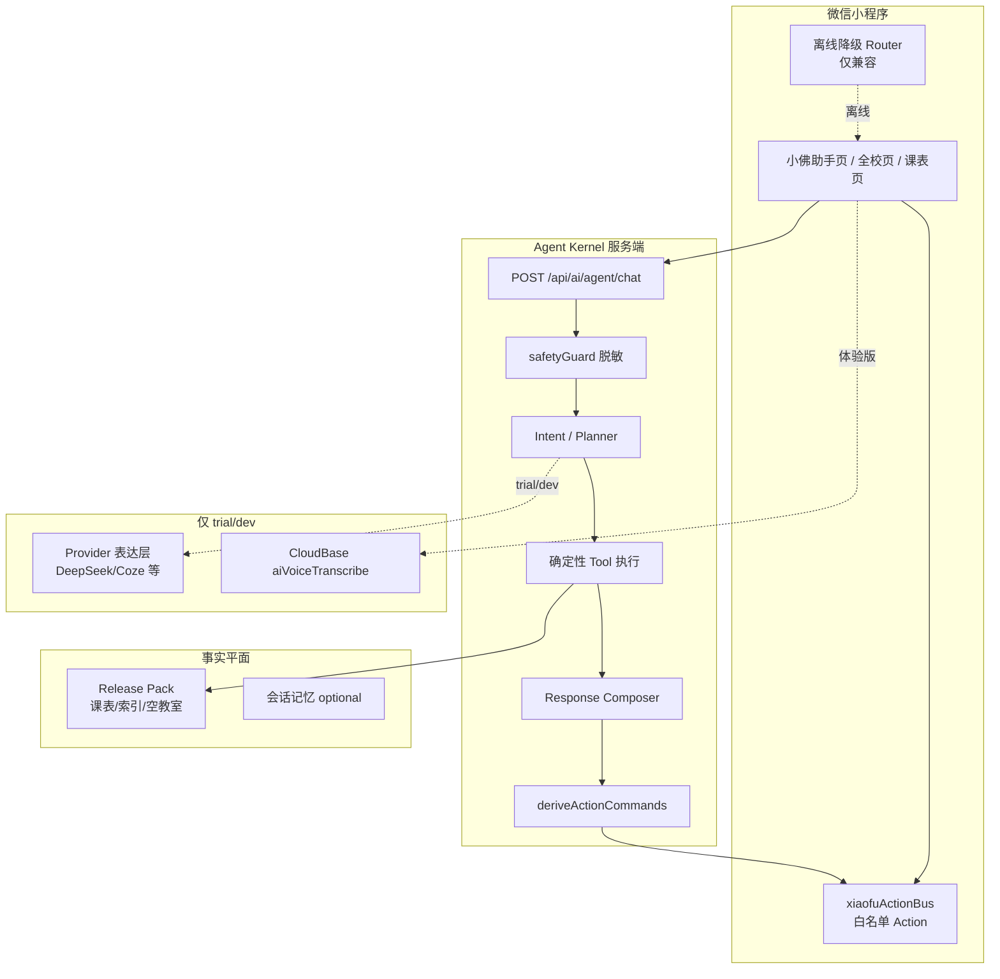

# 小佛助手（FosuClass）智能体设计说明书

> 参赛赛道建议：数智生活 / 校园服务综合应用  
> 作品形态：原生微信小程序 + Node.js 服务端 Agent Kernel + Release Pack 确定性数据平面  
> 程序交付：完整源代码（可编译、可运行、含注释与文档）

---

## 1. 设计思路

### 1.1 问题定义

佛山大学学生日常高频任务包括：查个人/班级/教师课表、找空教室、看今日安排、导入个人课表、查询校园公开知识。传统小程序需要在多个 Tab 与筛选面板间跳转，且：

- **入口分散**：班级、教师、教室、课程分属不同查询路径；
- **筛选门槛高**：学院、节次、楼栋等参数对新生不友好；
- **事实可信度要求高**：课表不能由大模型“编造”，必须可追溯到权威数据源；
- **隐私敏感**：学号、密码、完整个人课表不得进入模型上下文。

### 1.2 核心设计原则

| 原则 | 说明 |
|------|------|
| **工具优先 / 事实可核查** | 课表、教师、空教室等事实只来自 Release Pack 与确定性工具，模型只做表达与编排 |
| **public 零外部模型** | 正式版（public）不调用任何外部 Provider，保证可演示、可验收、零密钥依赖 |
| **数据最小化** | Provider 仅接收脱敏消息与裁剪后的工具结果；禁止学号/密码/Cookie/Token 入模 |
| **体验与安全同构** | trial/dev 可开表达层，但与 public 共享同一套 Intent / Skill / Tool / Action 安全边界 |
| **可降级** | 网络失败、Provider 失败、索引旧版本时，保留确定性结果或 last-known-good |

### 1.3 产品定位

**小佛助手** = 面向佛山大学的**校园任务型 Agent**，嵌在「佛课小表」微信小程序中：

- 自然语言完成「查教师课表 → 直接打开」「找空教室」「设为首页课表」等任务；
- 全校页提供结构化筛选，与 Agent **共用同一 Teacher Search Contract**；
- 语音输入（体验版）走 CloudBase 转写，不自动发送，用户可校对。

---

## 2. 系统架构

### 2.1 总体架构



### 2.2 关键决策：服务端 Kernel 唯一

- **在线决策核心**在服务端 Agent Kernel（`server/src/services/ai/`）。
- 小程序 `xiaofuAgentRouter` **仅**用于离线降级，不发展成平行在线 Agent。
- 能力权威源：`server/config/agent-capability-manifest.json`，经脚本生成客户端兼容表，禁止手工双份清单。

### 2.3 数据平面：Release Pack

- 全校班级/教师/教室/课程索引与详情以 **Release Pack** 版本化发布。
- 教师索引 **Schema v3+**：`id/detailId`、`teacherName`、`normalizedName`、`collegeCode(s)`、`collegeName(s)`、`courseCount`、`term`、`releaseVersion`；学院关系由课表课程派生。
- 失败时保留 last-known-good；禁止生成式模型补全课表事实。

---

## 3. 功能模块

### 3.1 自然语言任务（小佛助手）

| 能力 | 实现要点 |
|------|----------|
| 查教师/班级/教室/课程 | `search_school_index` → 结果卡 + **打开×课表** 直达 `schedule-view` |
| 查空教室 | `search_empty_rooms` / 连续节数约束 |
| 今日/明日课表 | 个人课表摘要 + 工具 |
| 设为首页课表 | `setCurrentSchedule` + 用户确认 + Receipt |
| 澄清与追问 | Working Memory / pendingClarification 跨轮 |
| 语音输入 | 隐私 → `scope.record` → 录音 → ASR → **填框不发送** |
| 会话记忆 | 默认 local_only；cloud_sync 需显式开启 |

### 3.2 全校结构化查询

- 学院/关键词筛选与 Agent **同一过滤语义**（精确姓名优先、`collegeCodes` 严格匹配）。
- 客户端使用完整教师索引本地过滤；**禁止**把「单次搜索结果」写回全量索引缓存（已修复缓存污染）。
- 点选结果打开课表，参数：`type, id, name, term, releaseVersion`。

### 3.3 课表浏览与同步

- 首页/今日/课表详情：Release Pack + 个人 XLS 导入（不收集学号密码进 Agent）。
- `scheduleNavigationService` 供助手与全校页共用。

### 3.4 安全与运行模式

| 模式 | 外部模型 | 用途 |
|------|----------|------|
| **public** | **0 次** | 正式版 / 比赛演示默认 |
| trial / dev | 可配置 | 表达增强，失败回退确定性结果 |

---

## 4. 算法与关键机制

### 4.1 意图与规划

1. 规则 / GoalParser 解析目标（如 `open_schedule`、天气、空教室）。
2. 缺槽位则 `clarify_missing_slot`。
3. public 走确定性计划；trial/dev 可模型规划，失败回退。
4. Observation → Verify → Replan **最多 1 次**，不伪造 Thinking。

### 4.2 教师搜索合同（Teacher Search Contract）

```
输入: type=teacher, q, collegeCode?, term, releaseVersion, schemaVersion
处理:
  1. 加载完整 teachers index（静态/缓存，schema 版本化）
  2. 学院严格匹配 collegeCode ∪ collegeCodes[]
  3. 精确姓名优先；存在精确命中时不返回模糊噪声
  4. 无学院时全校检索
输出: 与 Agent 工具链相同的 items 模型
缓存键: 含 q, collegeCode, term, releaseVersion, teacherIndexSchemaVersion
```

**反例（已修）**：曾把「搜陈芳」的命中列表误写入全量索引缓存，导致全校页只剩陈芳可搜。

### 4.3 Schedule Navigation

- 唯一命中：主按钮「打开教师/班级/教室/课程课表」→ `/pages/schedule-view/schedule-view`。
- 多候选：行点选 `detailId`。
- 无 `detailId`：降级全校页 + pending query。
- 不通过 URL 传完整 courses 数组。

### 4.4 语音权限状态机（reasonCode）

顺序：隐私授权 → `scope.record` → RecorderManager → 系统录音。

| reasonCode | 含义 | 用户动作 |
|------------|------|----------|
| PRIVACY_NOT_ACCEPTED | 未同意隐私 | 引导隐私指引 |
| WECHAT_RECORD_UNDECIDED | 首次未决定 | **可再 authorize** |
| WECHAT_RECORD_DENIED | 已拒绝 | 打开设置 |
| SYSTEM_MIC_DENIED | 系统禁止 | 系统设置 |
| RECORDER_START_FAILED | 启动失败 | 重试 |
| ASR_NOT_ENABLED / ASR_FAILED | 识别侧 | 与权限错误分离展示 |

### 4.5 Hybrid RAG（公开知识）

- 仅覆盖公开知识库；**禁止**向量化课表事实。
- Embedding 不可用时自动 Lexical 退化。

### 4.6 Response Composer

- 决定展示层级：普通对话不堆 Evidence / 不乱出「小佛助手」通用卡。
- 领域失败中文映射，不泄漏 tool 内部名。

---

## 5. 技术栈与交付物

| 层级 | 技术 |
|------|------|
| 客户端 | 原生微信小程序（主包 + packageXiaofu / packageMaps） |
| 服务端 | Node.js Express 模块化单体 |
| 数据 | Release Pack 静态索引 + 受控 API |
| 语音 | 微信录音 + CloudBase 云函数 ASR（体验版） |
| 测试 | agent-release-gate、core-experience、教师搜索/几何门禁 |

**仓库结构（摘要）**

- `miniprogram/` 小程序
- `server/` Agent Kernel 与 API
- `server/config/agent-capability-manifest.json` 能力权威源
- `docs/competition-2026-agent-design.md` 本说明书
- `docs/demo-script-5min.md` 演示脚本
- `AGENTS.md` / `README.md` 工程约束与说明

---

## 6. 安全与合规

1. 学号、密码、Cookie、Authorization、API Key 不得进入模型、Trace、普通日志。  
2. Action Bus 白名单页面；写操作需确认与审计。  
3. 知识库 publish/rollback 为高风险操作，须人工确认。  
4. 联网检索结果只能成草稿，禁止直接发布。  
5. public 模式外部 Provider 调用次数恒为零。

---

## 7. 创新点与竞争力（对标评审）

| 维度 | 本作品优势 |
|------|------------|
| **应用创新** | 自然语言任务 + 全校结构化查询统一数据合同；结果一键打开课表，而非停在文案 |
| **技术完整度** | 端到端：意图→工具→证据→卡片→白名单导航→Release Pack 版本化 |
| **事实可信** | 生成式模型不是课表事实源；可演示、可抽检 |
| **安全** | public 零外部模型；隐私与麦克风可诊断状态机 |
| **可演示性** | 正式路径 mock 可跑通；体验版可展示语音与增强表达 |
| **工程化** | 能力清单生成链、release-gate 测试、缓存版本防污染 |

---

## 8. 与参赛材料要求对照

| 要求 | 本仓库对应 |
|------|------------|
| ① 智能体设计说明书 | **本文档** |
| ② 演示视频 ≤5 分钟 | 见 `docs/demo-script-5min.md` |
| ③ 代码开发完整源码 | GitHub 仓库 + 可运行小程序/服务端 |
| 可选在线演示 | 微信小程序体验版权限给评委 |

---

## 9. 运行与验收要点（给评委）

1. 小程序：小佛助手问「查陈芳老师的课表」→ 打开教师课表。  
2. 全校页：教师 Tab，学院=动物科技学院，关键词=陈芳 → 命中；人文学院 → 不命中；不选学院 → 全校命中。  
3. 其他教师姓名关键词在学院筛选下仍可检索（完整索引过滤，非缓存污染）。  
4. public 模式无外部大模型调用。  
5. 体验版（可选）：麦克风授权后录音，识别文字进入输入框，**不自动发送**。

---

*文档版本：2026-07 · 与 main 分支 Teacher Search Contract v3/v4 缓存纪元、ScheduleNavigation、composer 流式底栏布局一致。*
