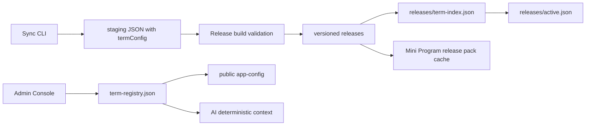

# Multi-Semester Architecture

FosuClass now treats the semester as a first-class lifecycle object instead of a frontend dropdown value.



## Authoritative Model

`server/storage/term-registry.json` is the authoritative registry. In production it is stored under `FOSU_STORAGE_DIR`.

```json
{
  "schemaVersion": 1,
  "activeTerm": "2025-2026-2",
  "updatedAt": "2026-06-09T00:00:00.000Z",
  "terms": [
    {
      "term": "2025-2026-2",
      "semesterText": "2025-2026学年第二学期",
      "termStartDate": "2026-03-09",
      "totalWeeks": 20,
      "weekStart": "monday",
      "status": "current",
      "releaseVersion": "2026-06-05T12-39-28",
      "dataAvailable": true,
      "publishedAt": "2026-06-05T12:39:28.000Z",
      "updatedAt": "2026-06-05T12:39:28.000Z",
      "source": "migrated-active-release"
    }
  ]
}
```

Allowed statuses: `planned`, `ready`, `current`, `archived`, `disabled`.

Only one term may be `current`. `planned` terms may omit `termStartDate`, but cannot be activated. The only fixed production fallback is the explicitly labelled legacy compatibility fallback for the already published `2025-2026-2` term.

## Release Mapping

`server/storage/releases/term-index.json` maps terms to active and rollback releases. `releases/active.json` remains the compatibility pointer for the current default term.

Term-aware APIs validate that requested term, registry record, term-index release, release manifest, catalog storage, and static pack all agree before returning data.

