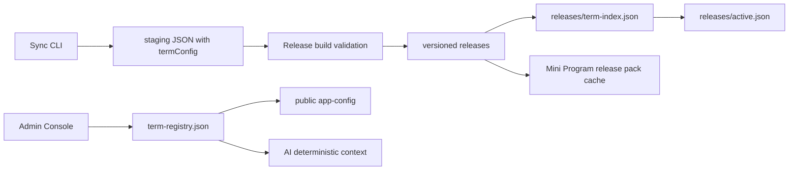

# 多学期架构

FosuClass 现在把“学期”作为一等生命周期对象管理，而不是只把它当作前端下拉框里的一个值。



## 权威模型

`server/storage/term-registry.json` 是学期权威注册表。生产环境中，它位于 `FOSU_STORAGE_DIR` 下。

```json
{
  "schemaVersion": 1,
  "activeTerm": "2025-2026-2",
  "updatedAt": "2026-06-09T00:00:00.000Z",
  "terms": [
    {
      "term": "2025-2026-2",
      "semesterText": "2025-2026学年第二学期",
      "termStartDate": "2026-03-09",
      "totalWeeks": 20,
      "weekStart": "monday",
      "status": "current",
      "releaseVersion": "2026-06-05T12-39-28",
      "dataAvailable": true,
      "publishedAt": "2026-06-05T12:39:28.000Z",
      "updatedAt": "2026-06-05T12:39:28.000Z",
      "source": "migrated-active-release"
    }
  ]
}
```

允许的状态：

- `planned`：已创建但未准备好，不对普通查询开放。
- `ready`：已有健康 Release，可等待切换。
- `current`：当前线上学期。
- `archived`：历史学期。
- `disabled`：禁用学期。

同一时间只能有一个学期处于 `current`。`planned` 学期可以暂缺 `termStartDate`，但不能被激活。唯一固定的生产回退，是为已发布的 `2025-2026-2` 学期保留的、明确标注的旧版兼容回退。

## Release 映射

`server/storage/releases/term-index.json` 将学期映射到 active 和 rollback Release。`releases/active.json` 仍作为当前默认学期的兼容指针保留。

所有支持学期的 API 在返回数据前，都要验证以下信息一致：

- 请求的 term。
- registry 记录。
- term-index 中的 Release。
- Release manifest。
- catalog 存储。
- 静态 Release Pack。
# 2026 sync operations update

Local sync caches are now isolated by `tools/fosu-sync-client/.cache/{term}`.
Dynamic schedules are written under run-scoped directories and only promote to
`latest.json` after validation. Daily and new-term commands default to
`network-only`, `ignore` progress, `ignore` negative cache, and
`mergeOldData=false`.

Release manifests may include `scopeSources` without breaking older clients:

```json
{
  "scopeSources": {
    "classSchedules": { "mode": "network-direct" },
    "teacherSchedules": { "mode": "network-direct" },
    "classroomSchedules": { "mode": "network-direct" },
    "courseSchedules": { "mode": "network-direct" }
  }
}
```

Future terms stay `planned` or `ready` until an administrator explicitly
activates them. Runtime pointer updates, term-index writes, OpenResty sync, and
mini program probes are treated as one publish lifecycle; any failure preserves
the previous active release.
