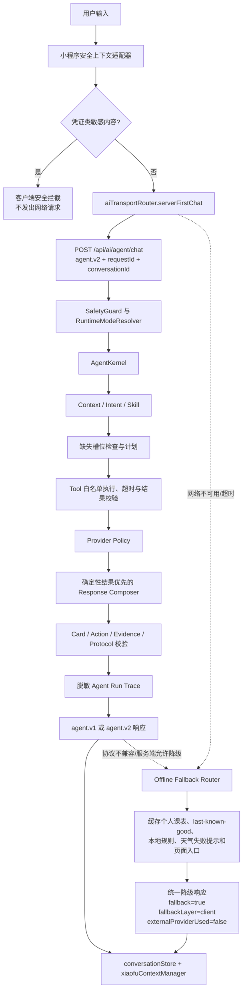

# 小佛助手 Agent V2 第一阶段架构

## 1. 阶段目标与边界

第一阶段解决的是“在线场景存在客户端和服务端两个决策中心”的问题。实现保留原有课表、空教室、教学周、天气、地图、个人课表、知识库和后台能力，不改变课程事实来源，也不部署向量数据库、远程 MCP 或生产环境。

当前架构的关键约束是：

- 在线语义请求由服务端 Agent Kernel 统一做 Intent、Skill、Tool、Provider 和响应决策。
- 小程序保留敏感凭证的网络前拦截，以及网络/超时/协议不兼容/服务端明确允许降级时的离线能力。
- `agent.v1` 继续服务旧客户端；新客户端默认请求 `agent.v2`。
- `public` 零生成式 Provider；`trial`/`dev` 也只允许能力清单明确授权的非事实 Intent 使用生成式表达层。

## 2. 原有双决策根因

改造前，`aiAssistantService.chat` 先调用 `xiaofuAgentRouter`，天气、课表状态、帮助、导航、知识检索、部分个人课表和全校课表请求会直接在小程序端生成答案与卡片。其余请求再进入 `aiTransportRouter`，后者又通过 `aiRouteClassifier` 在服务端确定性路由和客户端 CloudBase 混元表达层之间选择。服务端同时维护另一套 Intent、Tool、Provider 和协议逻辑。

因此同一句话可能因小程序版本、环境、网络状态或客户端 Provider 开关走不同链路；客户端粗粒度 Intent（如 `schedule_query`、`weather`）与服务端 canonical Intent（如 `search_school_index`、`get_campus_weather`）也会分叉。会话槽位随后依赖旧的 `metrics.intentName` 更新，canonical Intent 可能无法完整写回。

## 3. 当前真实调用流程



纯 UI 行为（关闭浮窗、复制、打开已有页面等）仍由页面直接处理，不经过 Agent。

## 4. 服务端模块边界

| 边界 | 当前实现 | 责任 |
| --- | --- | --- |
| Capability Manifest | `server/config/agent-capability-manifest.json` | Intent、Skill、Tool、Card、运行模式、Provider 权限、槽位、安全级别和降级策略的唯一权威源 |
| Manifest Loader/Validator | `capabilityManifestService.js` | 冻结并查询清单，生成公开裁剪视图，执行协议/工具/Skill/客户端映射一致性检查 |
| Runtime Mode Resolver | `runtimeModeService.js` | 把 `competition` 兼容映射到 `trial`/`dev`；服务端配置优先；Release 请求强制 `public` |
| Intent Resolver | `toolRegistry.resolveIntent` | 使用现有确定性规则产生 canonical Intent 与槽位 |
| Skill Registry | `skillRegistry.js` | 从 Manifest 建立可执行 Skill；提供 `planBuilder`、`resultVerifier` 和 Tool/运行模式白名单检查 |
| Agent Kernel | `agentKernel.js` | 规范化输入和上下文、选择 Skill、检查槽位、限制计划、执行工具、构造步骤/观察、校验结果 |
| Tool Registry/Executor | `toolRegistry.js` | 复用现有课表、空教室、天气、地图、知识检索与个人课表确定性实现；拒绝未知 Tool |
| Provider Policy/Chain | `agentService.js`、`providerFactory.js`、`providerChainService.js` | 只为获准的 `trial`/`dev` 非事实 Intent 选择表达层；失败回到确定性结果 |
| Response/Protocol | `agentService.js`、`agentProtocol.js`、`generatedPayloadContract.js` | 合并答案、验证 Card/Action/Evidence，并按 V1/V2 序列化 |
| Safety | `safetyGuard.js` | 输入、上下文、工具结果、Provider 输入、响应和日志脱敏 |
| Trace | `agentTraceRecorder.js` | 记录受限、脱敏的运行元数据，不保存原始消息或完整个人课表 |

这些边界是可执行模块而非占位接口；现有 Tool 业务函数被复用，没有引入大型 Agent 框架。

## 5. Capability Manifest 的编译边界

权威清单位于：

```text
server/config/agent-capability-manifest.json
```

它当前使用 `agent-capabilities.v1` Schema，声明 `agent.v1`/`agent.v2`、25 个 canonical Intent、20 个 Skill、21 个 Tool、9 个服务端 Card 类型，以及最大 6 步、直接逐步执行器单 Tool 8 秒、Observation 最长 480 字符、Trace 最多 500 条/保留 7 天等限制。默认复用的既有多工具链以 `8 秒 × 最大 6 步` 作为整条链的总超时上限；后续若拆成动态逐步循环，应改为逐 Tool 与整次运行双重预算。

微信小程序不能在运行时读取服务端目录。因此构建脚本：

```text
tools/generate-agent-capability-compat.js
```

只把协议版本、canonical Intent 列表和离线兼容映射裁剪生成到：

```text
miniprogram/shared/agentCapabilityCompat.generated.js
```

生成文件不可手工编辑。`test-agent-capability-manifest.js` 使用 `--check` 验证生成物未漂移，并联检协议 Intent、Tool Registry、Skill 的 Tool/模式、客户端兼容映射以及 public Provider 禁止规则。

## 6. Protocol V1/V2

未指定协议版本的旧请求仍按 `agent.v1` 返回，保留对象形态的 `intent`、`taskSteps`、旧运行模式名和既有卡片字段。V1 中 `trial`/`dev` 被序列化为兼容名 `competition`。

`agent.v2` 使用 canonical `public`/`trial`/`dev`，稳定返回：

```text
protocolVersion, requestId, conversationId, runtimeMode, runId, status,
intent, confidence, slots, skill, plan, steps, toolCalls, observations,
answer, cards, suggestions, evidence, safety, metrics, errors, serverTime
```

其中 `plan` 是可展示的简短步骤，不是隐藏思维链；`steps` 只包含执行状态、工具、耗时、错误码和重试标记；`observations` 是脱敏裁剪后的摘要。协议层继续校验 Card 与 Action 白名单，并清除系统提示、内部地址、凭证和完整工具原文。

公开只读接口 `GET /api/ai/agent/capabilities` 返回协议版本、服务端配置的当前模式、公开能力、Card 类型和增强模式状态。它不返回密钥、Provider 链配置、账户白名单、内部 URL 或部署信息。聊天请求仍会额外依据小程序 `envVersion` 执行 Release fail-closed，因此接口展示的部署配置模式与单次 Release 请求最终使用的 `public` 模式需要区分。

## 7. 运行模式和 Provider 边界

| 模式 | 模式来源 | 外部 Provider | 事实任务 |
| --- | --- | --- | --- |
| `public` | 服务端配置为 public，或任何 Release 请求强制降级 | 始终禁止生成式 Provider；Provider 配置错误不影响核心能力 | 只执行确定性工具 |
| `trial` | 服务端配置为 trial；旧 `competition` 默认映射到 trial | 仅能力清单允许的非事实 Intent；仍受服务端会话/开关约束 | 先工具，模型不得覆盖事实；事实 Intent 实际禁止 Provider |
| `dev` | 服务端配置为 dev | 与 trial 相同，供开发验证 | 同上 |

客户端提交的 `runtimeMode` 只用于观察和兼容，不能把 public 服务端提升为增强模式，也不能把服务端选择的 trial/dev 改成另一模式。这里的 Provider 指生成式表达层；天气等既有确定性数据 API 不属于生成式 Provider，仍按其原有超时、失败提示和 Evidence 规则运行。

## 8. 客户端离线边界

`aiAssistantService.chat` 现在先构造最小安全上下文并调用服务端。只有以下情况进入 `offlineChat`：

- 网络不可用或连接失败；
- 请求超时/服务端不可用；
- 返回协议不是生成的兼容列表；
- 服务端返回 `fallbackAllowed=true`。

`xiaofuAgentRouter`、`scheduleAssistantService`、`ragRetriever`、`ragAnswerBuilder` 继续保留，定位为 Offline Fallback/Compatibility Router。离线层可读取用户已授权的本机课表摘要、Release Pack/last-known-good 缓存、天气失败提示和既有页面入口，不调用生成式 Provider。旧本地 Card 类型会在返回前映射到 Manifest 的 Card 白名单。响应统一带 `fallback=true`、`fallbackLayer=client`、`externalProviderUsed=false` 和可诊断的 `fallbackReason`。

客户端网络前的凭证拦截是例外安全路径：检测到学号/密码/Cookie/Token 等内容时直接返回本地安全说明，原始内容不会发往服务端。

## 9. Trace 与数据保留

每次正常 Kernel 运行以及协议错误、空消息、敏感凭证和服务异常等早退路径都会记录一条 Trace。当前字段包括 run/request ID、conversationId 的 SHA-256 截断哈希、模式、Intent、Skill、步骤/工具状态与耗时、总耗时、Provider 是否使用、降级层级/原因、Evidence 完整性和错误码。

Trace 当前只保存在服务进程内存中，最多 500 条，按 7 天窗口裁剪；服务重启后不会保留。它不包含原始消息、完整个人课表、Provider 输入、系统提示、内部 URL 或密钥。持久化与集中观测属于下一阶段工作。

## 10. 知识库边界

现有 `knowledgeBaseService.js` 继续负责 draft/published/backups、导入预览、草稿增删改、发布、回滚和 lexical search。第一阶段新增 `knowledgeControlPlane.js`，提供可测试的五个边界：

- `KnowledgeRepository`
- `KnowledgeSearchProvider`
- `KnowledgeVersionService`
- `KnowledgeValidationService`
- `KnowledgeAuditService`

这些是下一阶段接入服务端记忆和 MCP 控制面的适配层；本阶段没有把后台路由整体迁移到这些类，也没有启动 MCP Server、向量检索或远程写入。

## 11. 已知技术债

- `aiTransportRouter.js` 中旧客户端表达层实现仍作为未导出、未调用的兼容代码保留；在线导出入口已经固定为 `serverFirstChat`。后续在行为回归稳定后可以单独删除死代码。
- 客户端离线 Router 保留粗粒度 Intent，但 canonical 映射来自生成物；它不是在线决策源。
- Trace 是单进程内存实现，尚无跨实例聚合和持久化。
- `server/config/admin-rollout-manifest.json` 现已由远端 admin 迁移提交提供；Agent 能力权威源为同目录的 `agent-capability-manifest.json`，并在 `server/Dockerfile` 中一并复制进运行镜像。
