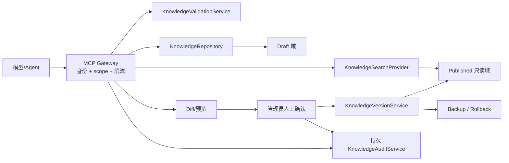

# 知识库 MCP 控制面边界

## 1. 本阶段实现状态

本阶段没有部署 MCP Server，没有接入向量数据库，也没有开放远程可写知识库接口。

现有 `server/src/services/ai/knowledgeBaseService.js` 的数据和行为保持不变：

- draft / published 分区；
- 发布前 backup，最多保留既有受控数量；
- Markdown import preview 与安全检查；
- create/update/delete draft；
- publish；
- rollback；
- 对已发布规则和文档的 lexical search。

新增 `server/src/services/ai/knowledgeControlPlane.js` 只提供下一阶段可复用的适配边界：

| 接口 | 当前职责 | 当前持久化/接入状态 |
| --- | --- | --- |
| `KnowledgeRepository` | 草稿列表、创建、更新、删除、导入预览/提交 | 复用 `knowledgeBaseService`；未替换后台路由 |
| `KnowledgeSearchProvider` | 已发布 lexical search 和单条公开知识读取 | 复用现有搜索；无向量检索 |
| `KnowledgeVersionService` | 当前版本、publish/rollback、draft 与 published ID Diff | 复用现有版本/备份；高风险方法尚未暴露给 MCP |
| `KnowledgeValidationService` | 条目和导入安全验证 | 复用现有 Prompt Injection/内容风险检查 |
| `KnowledgeAuditService` | 记录动作、目标、版本、成功/错误码 | 仅适配器内存审计，最多 500 条；不是生产后台审计替代品 |

现有管理员 API 的鉴权、审计、发布和回滚路径仍在 `server/src/routes/admin.js`；不能因为已有这些接口，就把适配器描述成已上线的远程控制面。

## 2. 未来 MCP 的信任边界

MCP 应位于后台授权层之后，而不是让模型直连知识库文件或获得管理员 Token：



模型只能持有当前操作的最小 scope 和短期凭证，绝不能持有后台管理员 Token。所有写入参数在进入业务服务前都必须经过 Schema、安全、冲突和权限验证。

## 3. 未来 MCP Resources（只读）

第一批 Resources 只暴露已发布、可公开的数据：

| Resource | 内容 | 约束 |
| --- | --- | --- |
| `knowledge://published/index` | 已发布知识条目索引 | 分页、字段裁剪，不含草稿和内部备注 |
| `knowledge://published/{id}` | 单条已发布知识详情 | 仅 public 范围；不存在时返回稳定错误 |
| `knowledge://version` | 当前知识库版本、发布时间和公开统计 | 不返回备份路径和内部部署信息 |
| `knowledge://schema` | 公开条目 Schema 与允许字段 | 不包含后台权限策略细节 |
| `knowledge://search?...` | 公开 lexical/未来混合检索结果 | 返回来源、版本、检查时间和截断片段 |

Resources 必须是只读的，不提供通过 URI 修改、发布或回滚的语义。

## 4. 未来低风险 MCP Tools

在完成身份、scope、审计和幂等设计后，可以逐步评估：

| Tool | 允许作用域 | 必须检查 |
| --- | --- | --- |
| `search` | published 只读 | 查询长度、结果上限、公开范围 |
| `get` | published 只读 | ID、公开范围、字段裁剪 |
| `create_draft` | draft 写入 | Schema、安全、重复、来源、幂等键 |
| `update_draft` | draft 写入 | 版本前置条件、Diff、scope、幂等键 |
| `preview_import` | 不落盘 | 文件/文本大小、安全、来源、解析错误 |
| `validate` | 不落盘 | Prompt Injection、敏感内容、链接/来源规则 |
| `diff` | 只读比较 | draft/published 版本、字段裁剪 |
| `delete_draft` | draft 可恢复删除 | 精确目标、scope、审计、确认票据或回收站 |

`create_draft`、`update_draft` 和 `delete_draft` 仍是写操作；“低风险”只表示它们不能直接改变 published，不代表可以跳过授权和审计。

## 5. 禁止直接暴露的高风险操作

以下操作不得作为无确认的普通 MCP Tool：

- `publish`；
- `rollback`；
- 批量删除；
- 修改条目的 public 范围；
- 修改规则的 Tool/Intent 绑定；
- 直接抓取网页并自动发布。

未来如确需自动化，必须同时具备：

1. 独立人工确认；
2. 精确到动作和对象的 scope；
3. 可查询的持久审计；
4. 幂等键和重放防护；
5. 发布前 Diff 与安全报告；
6. 原子版本切换和已验证回滚；
7. 操作者、确认者和执行者身份记录。

不得把当前内存 `KnowledgeAuditService` 当作满足上述生产要求。

## 6. 联网搜索补充知识库的唯一允许链路

```text
联网检索
→ 来源抓取
→ 内容提取
→ 记录来源 URL、发布/抓取时间和内容哈希
→ 生成候选草稿
→ 凭证、Prompt Injection、恶意链接和隐私检查
→ 重复、过期和冲突检查
→ 管理员预览 Diff 与来源
→ 人工确认
→ 发布不可变版本
→ 记录审计并保留可回滚备份
```

禁止“搜索结果直接写入并发布”。检索摘要不能被当作学校官方事实；对时效性信息必须记录检查时间，必要时要求二次来源或管理员确认。

## 7. 数据域约束

- 全校课表、教师、教室、空教室、教学周不进入普通向量知识库；它们继续由 Release Pack、结构化索引和确定性 Tool 提供。
- 个人课表文件和完整摘要不进入知识库或 MCP。
- 草稿内容不能出现在 public Agent 的搜索结果中。
- 发布版本必须带 version/source/checkedAt 等 Evidence 元数据。
- MCP 返回值也必须经过 Agent Protocol 的 Observation 裁剪，不能把内部存储对象原样传给模型。

## 8. 下一阶段验收起点

下一阶段应从以下可测试工作开始，而不是先启动远程 MCP：

1. 让一个只读后台用例通过 `KnowledgeSearchProvider`，证明适配器可替换且行为等价；
2. 将 `KnowledgeAuditService` 替换成受控持久实现并加入保留策略；
3. 定义 Resource/Tool JSON Schema、scope 表和稳定错误码；
4. 为 draft 写入加入幂等键、预期版本和 Diff；
5. 建立 publish/rollback 的独立人工确认工作流；
6. 在无模型、无网络和恶意内容情况下运行端到端回归；
7. 通过上述门禁后，才评估只读 MCP Server 的受控部署。
