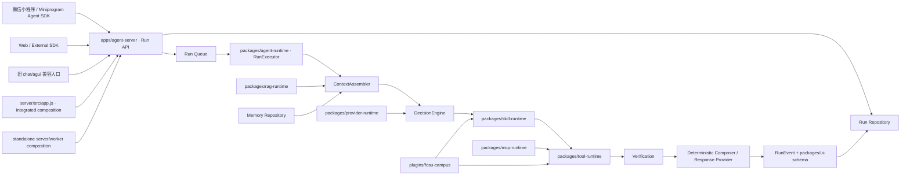
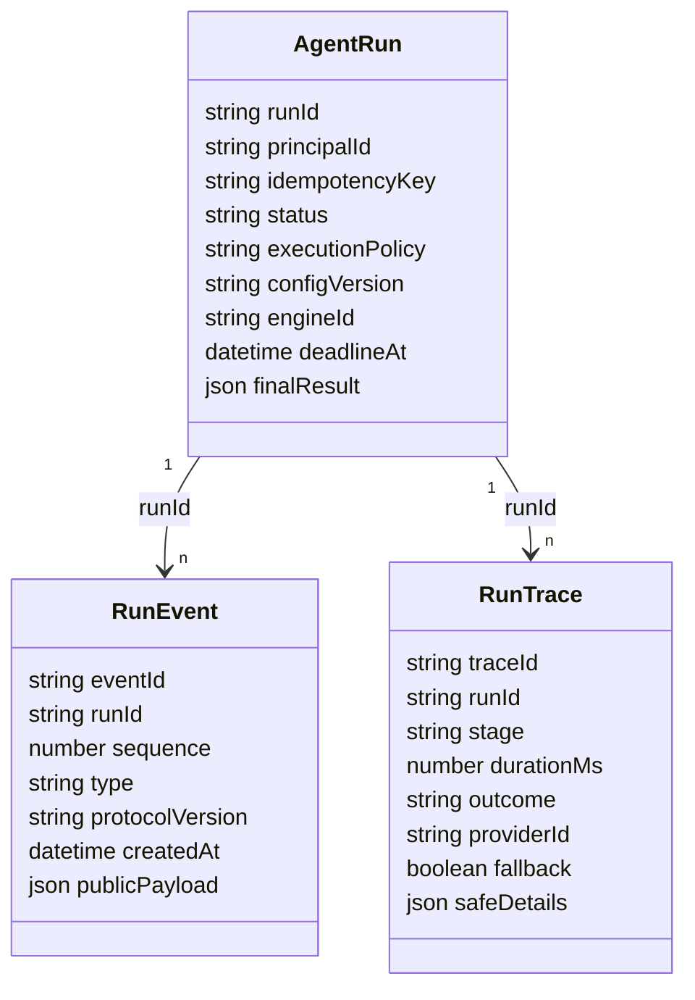
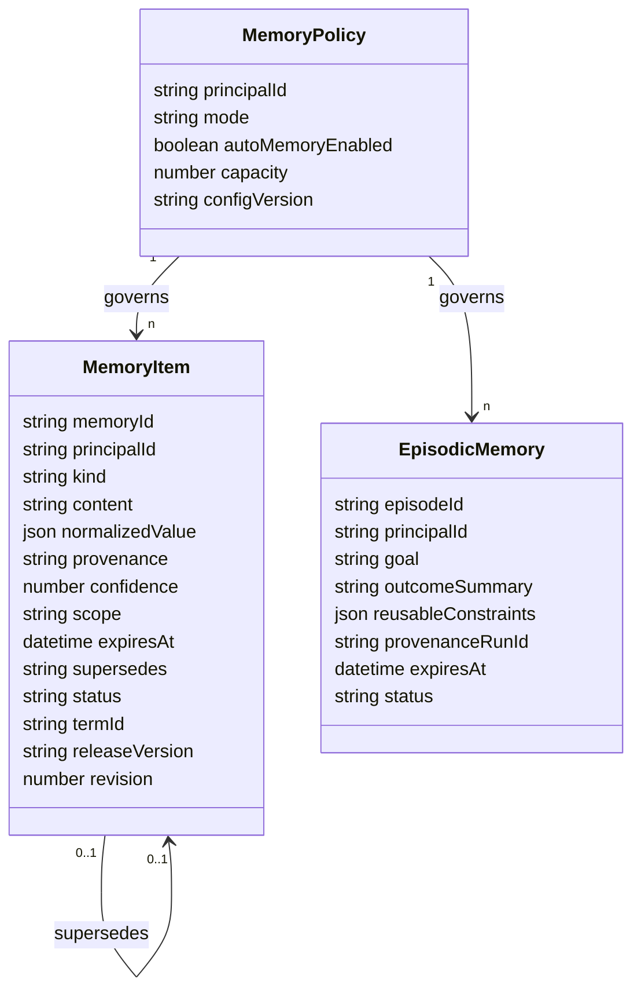

# 小佛助手 Agent 产品平台技术设计

> 需求：[`requirements.md`](./requirements.md)
> 已批准方案：共享 Composition Root 的端口/适配器式模块化单体
> 迁移原则：单一事实源、渐进绞杀、可回滚、ARM64 兼容、先核心后实验 Adapter

## 1. 设计目标

本设计把现有 Agent 内核迁为一套真正被生产请求调用的通用 Runtime，同时提供两种装配方式：

1. FosuClass 一体化：现有业务 API、Agent Runtime 和 Admin 继续在一个容器内运行，适合当前 VPS 平滑升级。
2. Standalone：`agent-server + agent-worker + PostgreSQL/pgvector + Redis`，不依赖 FosuClass 主业务即可运行。

两种方式必须调用相同的 `createAgentPlatform()`、AgentEngine、协议、配置快照和领域 Runtime。差异只存在于插件集合、Repository/Queue Adapter 与部署拓扑。

## 2. 架构不变量

- `apps/agent-server` 是唯一在线 Agent 执行入口。
- `packages/agent-runtime` 拥有 Decision → Skill/Tool → Verification → Response → RunEvent 编排。
- 旧 `agentService.chat()` 只能成为创建 Run 并等待结果的兼容门面；新 Runtime 不得反向调用整个旧 `agentService`。
- `plugins/fosu-campus` 是校园语义、Manifest、Release Pack Adapter、校园 Tool 和校园 UI mapper 的唯一装配点。
- 每个 Run 创建时固定 `configVersion`、`pluginVersions`、`releaseVersion` 与 Engine；进行中不漂移。
- 每个部署、每个领域只激活一个 Repository 实现；迁移时允许一次性导入，不允许长期双写。
- public 在 Runtime 最外层和 Provider Runtime 两层共同拒绝外部调用。
- 配置热发布只改变声明式 artifact 与 active pointer，不执行管理员上传的代码。

## 3. 生产拓扑与调用链



真实请求顺序：

1. HTTP Guard 验证 Session、Runtime Mode、协议版本、请求体与敏感字段。
2. `RunService.create()` 以 `(principal, idempotencyKey)` 原子建 Run，并立即追加 `run.accepted`。
3. API 返回 `202 { runId, pollToken, protocolVersion, eventCursor }`；不等待 Agent 执行。
4. Queue 调用唯一 `RunExecutor`。一体化使用可恢复的进程内 Queue，Standalone 使用 Redis Stream consumer group。
5. Executor 读取并固定已发布 ConfigSnapshot，创建总 Deadline 与 AbortController。
6. ContextAssembler 生成最小上下文。
7. DecisionEngine 按策略执行 deterministic、strict_model_first 或 adaptive。
8. Skill Runtime 解析声明式 Skill；Tool Runtime 计算五因子交集并校验参数。
9. Tool 执行后 Verification 对照事实 Evidence；必要时最多 replan 两次，但共享总 Deadline。
10. 简单事实走确定性 Composer；只有需要自然表达时调用 Response Provider。
11. 每个真实状态变化先持久化 RunEvent，再通知 SSE/轮询订阅者。
12. 终态保存最终 agent.v2 blocks，并按协商生成 agent.v1 兼容 payload。

## 4. Monorepo 与模块责任

根 `package.json` 使用 npm workspaces，保持现有 CommonJS 和 Node.js 运行方式，避免在迁移同时引入全仓 TypeScript/构建链改写。每个 workspace 都有明确入口、测试和依赖方向。

| 目录 | 责任 | 禁止依赖 |
| --- | --- | --- |
| `packages/agent-protocol` | DecisionContract V2、Run/RunEvent、Trace、ConfigSnapshot、agent.v1/v2 协议验证与兼容 | Express、Fosu 服务、具体 Provider |
| `packages/ui-schema` | 通用 UI block union、验证、agent.v1 卡片兼容映射接口 | 校园数据源、HTTP、Provider |
| `packages/agent-runtime` | RunExecutor、策略选择、Deadline、ContextAssembler、Engine 契约、阶段编排、Trace | Fosu 路由、Release Pack 固定路径 |
| `packages/provider-runtime` | Provider Adapter、结构化调用、连接池、预算、一次 fallback、熔断、probe、attempt metrics | Skill/Tool 业务实现 |
| `packages/skill-runtime` | 声明式 Skill Schema、版本 registry、候选解析、测试与发布验证 | 任意上传代码执行 |
| `packages/tool-runtime` | Tool descriptor、精确匹配、参数 Schema、五因子交集、授权、执行/取消 | 固定校园服务 |
| `packages/mcp-runtime` | Streamable HTTP/受控 stdio client、发现、鉴权引用、超时、环境 scope、写确认 | 后台直接发布、任意 shell |
| `packages/rag-runtime` | 摄取、解析、分块、BM25、向量、rerank、引用、版本与索引切换 | 课表事实替代逻辑 |
| `packages/agent-sdk` | Run 创建、轮询/SSE、断线续传、幂等、取消、协议协商 | 微信页面组件、Fosu 文案 |
| `plugins/fosu-campus` | 校园 Manifest/Skill/Tool、Release Pack 与现有事实服务 Adapter、校园 Composer/UI mapper | 通用 Runtime 内部私有状态 |
| `apps/agent-server` | Composition API、HTTP Router、Run API、health/readiness、integrated/standalone 启动入口 | 复制另一套 Kernel |
| `apps/agent-admin` | 共享控制面 API 与 Admin UI，读取同一 Config/Trace Repository | 直接修改进程 env 作为发布机制 |

依赖方向固定为：apps/plugins → domain packages → protocol/ui-schema。通用 package 之间只依赖公开入口，不通过相对路径穿透其他 package 的 `src`。

### 4.1 Composition API

```js
createAgentPlatform({
  runtimeModeResolver,
  plugins,
  repositories: {
    runs,
    config,
    memory,
    rag,
    audit,
  },
  queue,
  providers,
  clock,
  logger,
})
```

返回：

```js
{
  runService,
  runExecutor,
  controlPlane,
  readiness,
  createAgentRouter,
  createAdminRouter,
  shutdown,
}
```

一体化模式由 `server/src/app.js` 创建一次实例并挂载两个 Router；Standalone server 与 worker 从相同 factory 创建角色受限实例。测试可注入内存 Repository，但生产不得默认使用内存 Run Store。

## 5. 绞杀式迁移

### 5.1 入口反转

第一步不是移动所有文件，而是让 `/agent/runs` 进入新 `apps/agent-server`，由 `packages/agent-runtime` 的 Executor 拥有阶段顺序。旧 `agentService.chat()` 改为调用 `runService.createAndWait()`，确保所有在线入口汇合。

### 5.2 叶子复用规则

迁移初期可以适配以下叶子能力：现有 Provider HTTP Adapter、Release Pack、课表搜索、天气、地图、ActionReceipt、提醒与安全脱敏。它们必须通过公开 descriptor/port 注入；不得从新 Runtime 调用旧 `agentService.chat()`、`agentKernel.run()` 或另一套 Planner 主循环。

### 5.3 删除条件

每个旧编排模块只有在以下证据齐备后才能删除：

- golden fixture 对照一致；
- 新生产入口 Trace 包含对应 package/stage；
- agent.v1/v2 回归通过；
- public 零 Provider 通过；
- 回滚点已提交。

## 6. 执行策略与 DecisionContract V2

### 6.1 策略选择

| 模式 | 默认策略 | Decision 来源 | Provider 约束 |
| --- | --- | --- | --- |
| public | `deterministic` | 受审计规则 + Manifest | 外部 attempt 永远 0 |
| trial | `strict_model_first` | 首次真实结构化 Provider | 一次主调用 + 最多一次受控 fallback |
| dev | `strict_model_first` | 首次真实结构化 Provider | 同 trial，可启 staging probe |
| trial/dev 显式选择 | `adaptive` | 高置信快路径或 Provider | 快路径必须记录 deterministic source |

`competition` 在入口被规范化为 trial/dev 的既有映射，不形成策略值。

安全守卫可在 Decision 前终止空消息、协议错误、凭据泄露、未授权写操作和已取消 Run。这些不是“安全用户 Turn”，Trace 记录 `decisionSource=guard_rejected`。

### 6.2 DecisionContract V2

模型只能从请求中提供的 `allowedSkillIds` 选择 Skill，不接收或输出任意 Tool 名称。

```json
{
  "schemaVersion": "decision.v2",
  "goal": {
    "name": "open_schedule",
    "confidence": 0.97,
    "requiresClarification": false
  },
  "entities": [
    { "type": "class", "value": "24动物医学1班", "source": "user" }
  ],
  "constraints": {
    "date": null,
    "campus": null,
    "term": null
  },
  "skillCandidates": [
    { "skillId": "campus.schedule.open", "confidence": 0.96 }
  ],
  "plan": {
    "steps": [
      { "id": "resolve-target", "skillId": "campus.schedule.open", "purpose": "解析并打开目标课表" }
    ]
  },
  "responseMode": "deterministic"
}
```

Validator 执行：JSON parse → schema exact properties → enum/length/range → allowedSkillIds membership → Goal/Skill compatibility。失败时只允许同一 Provider 的受控 JSON 修复或一次 fallback，均计入 attempt；不得用规则输出伪装成模型 Decision。

### 6.3 Tool 五因子交集

最终可执行集合：

```text
manifestTools
∩ selectedSkill.allowedTools
∩ runtimeMode.allowedTools
∩ environment.availableTools
∩ safety.authorizedTools
```

Tool Runtime 只接受 exact ID；拒绝大小写模糊、前缀匹配和模型自造名称。参数在执行前后分别进行 input/output Schema 与敏感字段验证。写 Tool 必须携带确认凭证、scope 和幂等键。

## 7. Deadline、连接与 fallback

Run 创建时生成绝对 `deadlineAt`，最大 15 秒。每个阶段从剩余预算中取较小值：

| 阶段 | 简单任务预算 | 多工具任务预算 | 规则 |
| --- | ---: | ---: | --- |
| createRun/排队 | 500ms | 500ms | 首事件先持久化 |
| Decision | 3,500ms | 3,500ms | strict 只做一次结构化语义调用 |
| Tool | 1,200ms | 5,500ms | 每个 Tool 领取子预算 |
| Verification | 500ms | 1,000ms | 确定性优先 |
| Response | 800ms | 1,500ms | 简单事实为 0 Provider |
| 收尾余量 | 500ms | 1,000ms | terminal event 与持久化 |

预算不是串行固定等待；每阶段使用 `min(stageCap, deadlineRemaining - finishReserve)`。Provider fallback 与主调用共享 Decision/Response 阶段预算，且总共只允许一个 fallback Provider attempt。429、网络错误和超时进入熔断指标；Schema 错误只允许同 Provider 的一次快速修复且不切换多个 Provider 链。

Provider Runtime 维护按 origin/provider 复用的 keep-alive dispatcher。AbortSignal 贯穿 fetch、MCP、Tool 与 RAG；所有 Adapter 必须把取消映射为统一 `ABORTED`，不得吞掉后继续写成功事件。

## 8. Run、Event、Trace 与恢复

### 8.1 Run/Event 模型



- 唯一键：`(principal_id, idempotency_key)`。
- Event 唯一键：`(run_id, sequence)` 与 `event_id`。
- 追加 Event 和推进 Run 状态在同一 Repository transaction 中完成。
- GET 使用 `afterSequence`；SSE 从相同 Repository cursor 读取，不单独合成事件。
- terminal result 与事件具有配置 TTL，但不能短于客户端断线恢复窗口。

### 8.2 一体化 Repository

当前单容器使用持久卷内的 append-only journal + 原子 snapshot/pointer，复用已有 exclusive file lock 与 atomic write 机制。启动时重放 journal、恢复 accepted/running Run，并将无法安全恢复的外部副作用标记为需人工确认，而不是重复写操作。

### 8.3 Standalone Repository

- PostgreSQL：Run、Event、Trace、Config、Memory、RAG metadata、audit。
- pgvector：Memory/RAG 向量。
- Redis Streams：待执行 Run queue；Redis Pub/Sub 只做通知，不作为事件事实源。
- Redis 不可用时，Server 仍可接受受限数量 Run 并落库为 `queued_degraded`；Worker 恢复后重新派发。DB 不可用时创建 Run 应明确失败，不伪造接受。

## 9. ContextAssembler 与 Memory

### 9.1 Context 输入顺序与预算

ContextAssembler 是 Decision、Tool 和 Response 的唯一上下文入口。按以下优先级组装并裁剪：

1. 安全系统约束与已发布 Manifest 摘要；
2. 当前用户消息；
3. pending clarification/action；
4. Working State 与当前页面、日期、教学周、课表目标；
5. 最近 8–12 条脱敏消息；
6. 滚动摘要；
7. 语义相关 active 长期记忆；
8. 相关成功 episode；
9. RAG 引用摘要。

完整课表与原始 Tool output 永不进入通用上下文；Tool 只返回允许字段的裁剪 Observation。Response 再按表达需要取 ContextAssembler 的安全视图，不自行读取历史。

### 9.2 长期记忆实体



`kind` 只允许受审计类别，例如 stable_preference、identity_alias、interaction_preference、task_constraint；schedule_snapshot、weather、credential、raw_tool_output、hidden_reasoning 永远拒绝。

### 9.3 检索、冲突与失效

- 内置本地语义 encoder 使用稳定的中文/英文 token、实体 alias 与 feature hashing 生成向量，public 不产生外部调用；Standalone 可配置受审计 embedding Adapter，但 public upsert 仍使用本地实现。
- 召回分数由 lexical、vector cosine、recency、confidence、scope match 和 provenance freshness 组成。
- rerank 是确定性可解释函数；注入结果记录 memoryId 与分数，不记录原始敏感内容到 Trace。
- “不是 A，是 B”创建 B 并原子把 A 标记 `superseded`；默认检索只读 active。
- term/release scope 变化时批量标记相关条目 `expired_context`，不物理删除审计历史。
- TTL 使用持久 `expiresAt`，读取不得刷新；只有用户修改或受允许的确认写入才更新。

### 9.4 用户控制

Memory API 支持分页查看、单条 patch/delete、全部清除、暂停/恢复、JSON 导出。所有响应只包含用户自己的可见内容和元数据；cloud_sync 需显式开启，local_only 永不调用服务端同步写入。

## 10. 统一配置发布状态机

所有可配置领域共享以下 Artifact envelope：

```json
{
  "resourceType": "skill",
  "resourceId": "campus.schedule.open",
  "artifactVersion": "skill_01...",
  "status": "draft",
  "environment": "trial",
  "schemaVersion": "skill.v1",
  "payload": {},
  "createdBy": "principal:...",
  "createdAt": "...",
  "validation": {},
  "testEvidence": {}
}
```

状态转换：

```text
draft → validated → tested → published
  ↘ rejected       ↘ failed
published historical version → rollback（产生新的 published configVersion）
```

发布事务：

1. 校验 artifact schema、权限和环境范围。
2. 在隔离测试 Runtime 中执行声明式 fixture；真实 Provider probe 必须显式标记 staging。
3. 写入不可变 artifact。
4. 构建引用所有领域版本的不可变 ConfigSnapshot。
5. 原子切换 active pointer。
6. 一体化进程通知 hot reload；Standalone 通过 Redis 通知，但新 Run 每次仍从 Repository 校验 active version。
7. Admin 发起一条 canary Run，Trace 证明新 `configVersion` 被消费。

Rollback 不修改历史 artifact，而是发布一个指向旧 artifact 集合的新 ConfigSnapshot。

### 10.1 Provider

Provider 密钥只存引用（env/secret manager key），ConfigSnapshot 不含明文。控制面显示 configured、probe outcome、last verified configVersion、attempt latency/error/circuit；Run Trace 才是某 Turn 实际 Provider 的事实。

### 10.2 Skill 与 Tool

Skill 只包含 Goal/实体 Schema、allowedTools、计划模板、输出 UI block 与测试 fixture。Tool 实现来自镜像中已注册代码；后台只能发布 descriptor、启用状态、环境 scope、参数限制和确认策略。

### 10.3 MCP

MCP Server 配置只引用凭据，支持 Streamable HTTP 优先和显式 allowlist 的 stdio command。stdio executable 必须来自镜像内 allowlist，参数不可由用户自由拼接。发现的 Tool 先进入草稿，管理员验证/测试/发布后才能进入五因子交集。写 Tool 强制 confirmation。

## 11. RAG

### 11.1 摄取

- 文件：只接收 allowlist MIME/扩展名和尺寸上限；保存内容 hash，解析后原文件按策略删除或隔离。
- 网页：仅 http/https，DNS 解析与每次重定向后阻止 localhost、私网、链路本地和云元数据网段；限制响应大小、类型、跳转和总时长。
- 摄取结果永远是 draft，不自动发布。

### 11.2 索引版本

每个 RAG artifact 包含 document version、chunk set hash、BM25 index version、vector model/version 和 vector index version。只有 lexical/vector/rerank/citation 测试全部通过才原子切换 active pointer。发布和回滚按同一版本整体切换。

### 11.3 检索

```text
query normalization
→ BM25 topK
→ vector topK
→ reciprocal-rank + deterministic relevance rerank
→ citation verifier
→ minimal context snippets
```

结构化校园目标在 Decision/Skill 阶段被强制路由 Tool，RAG 只能补充公开解释性知识。

## 12. UI Schema 与客户端 SDK

统一 block：

```text
text | markdown | plan | tool_progress | list | detail | schedule |
clarification | confirmation | action_receipt | warning | error
```

每个 block 都有 `type`、`id`、`schemaVersion`、可选 `title` 和类型专属 payload。未知 block 使用安全 fallback text；不执行 HTML、脚本或远程组件。Fosu 插件把校园 Tool output 映射到 `schedule/list/detail/action_receipt`，而不是发明新的客户端组件名。

SDK 分层：

- `packages/agent-sdk`：环境无关状态机、HTTP/SSE Adapter 接口、cursor、retry、idempotency、cancel、result recovery。
- 小程序 transport：使用 `wx.request` 长轮询；平台支持时使用 SSE Adapter，否则不改变 SDK 状态机。
- Web/Node 示例：标准 fetch/SSE。

旧 agent.v1 payload 由 server compatibility presenter 从最终 blocks 投影；它不是第二套执行或事实源。

## 13. UI 设计规格

### 13.1 Admin Control Plane

**Purpose Statement**：为管理员提供配置发布、真实 Run Trace、性能与回滚工作台。核心任务是判断“当前发布了什么、真实运行了什么、失败后能否安全回退”，而不是展示营销型指标。

**Aesthetic Direction**：Industrial/utilitarian operations console，强调版本、时间线、状态差异和高密度可扫描信息。

**Color Palette**：沿用现有 Admin 品牌 token，避免在迁移中建立第二套视觉系统：page `#f4f2ed`、surface `#fbfaf7`、ink `#181b20`、primary `#3158c7`、brand/error accent `#c13b33`、success `#14795a`。深色主题继续使用现有对应 token。

**Typography**：沿用现有 Admin 的 `PingFang SC`、`Microsoft YaHei`、`Noto Sans CJK SC` 与代码区 `ui-monospace`。这是对仓库既有设计系统和离线可用性的窄范围覆盖，不新增远程字体；新模块不再显式优先使用 Inter。

**Layout Strategy**：保留侧边栏，主工作区采用左侧版本时间线、中部配置/Trace 主表、右侧可收起证据抽屉的不对称三栏；窄屏退化为主表 + bottom sheet。发布按钮与回滚按钮永远显示目标环境和版本，不使用居中卡片墙。

### 13.2 微信 Agent 稳定壳

**Purpose Statement**：让用户看到服务端真实执行进度与通用结果，同时保持现有“小佛助手”交互、校园卡片和微信性能边界。

**Aesthetic Direction**：Editorial/organic campus utility，延续纸张底色、克制红色品牌和绿色核验状态。

**Color Palette**：严格复用 `xiaofu-tokens.wxss`：background `#f6f4f1`、surface `#ffffff`、text `#2a2622`、primary `#c0392b`、success `#3d7a5a`、warning `#b45309`。

**Typography**：使用微信原生中文字体栈和现有字号 token；不下载字体，不改变当前可访问性与首屏性能。

**Layout Strategy**：消息流保持单列，plan/tool_progress 作为左边缘时间线嵌入消息，detail/list/schedule 使用全宽内容面，clarification/confirmation 使用底部操作面；不新增固定浮层遮挡输入区。图标继续使用项目内 SVG，不使用 emoji。

## 14. Engine Adapter

```js
class AgentEngineAdapter {
  get id() {}
  async decide(context, options) {}
  async executePlan(decision, runtimePorts, options) {}
  async compose(observation, context, options) {}
}
```

Fosu Engine 是默认实现，但仍只能通过通用 Runtime ports 使用 Provider/Tool/Memory/RAG/Event。OpenAI Agents SDK 与 Pi Adapter 只转换其各自 orchestration event 到同一 ports；Tool allowlist 在进入 Adapter 前已经固定。

Pi Adapter 注册的工具集合由项目 Tool Runtime提供，不暴露 Pi 内置 bash/read/write/edit。两个实验 Adapter 的 conformance fixture 都执行内置只读 `platform.echo` 或 Fosu 只读查询，不执行外部写操作；未通过则 feature flag 返回明确 unavailable，默认仍为 Fosu Engine。

## 15. 部署

### 15.1 一体化

- 现有 `server/Dockerfile` 安装 workspace production dependencies。
- `server/src/app.js` 同一进程装配业务 API、Agent Runtime、Admin。
- 持久卷包含现有 Release Pack 与统一 agent-platform data root。
- 启动先运行兼容迁移和 Repository integrity check，再对外 readiness。

### 15.2 Standalone

`deploy/standalone/docker-compose.yml`：

- `agent-server`：HTTP、SSE、Admin、readiness；
- `agent-worker`：Redis Stream consumer，调用同一 RunExecutor；
- `postgres`：启用 pgvector、健康检查、持久卷；
- `redis`：AOF、健康检查、持久卷。

Standalone 默认只加载内置 `platform-core` 示例插件；Fosu 插件仅在构建包含它且 allowlist 显式启用时加载。所有 secrets 通过环境或 secret file 引用，`.env.example` 只有占位值。

### 15.3 多架构

GitHub Actions 用 buildx 分别验证 linux/amd64 与 linux/arm64 smoke，随后以相同 SHA tag 推送单一 manifest list。任何架构 smoke 失败都不发布 manifest。镜像标签包括 commit SHA，不用 `latest` 作为回滚依据。

## 16. 可观测性与隐私

阶段 Trace 只保存决策输出摘要、Skill/Tool ID、验证结果、耗时、Provider ID、fallback 原因与 configVersion。Provider 原始 prompt/response、隐藏推理、密钥、Authorization、Cookie、完整课表和原始 Tool output 在 recorder 入口统一拒绝。

Metrics 以 stage/outcome/runtimeMode/provider 的低基数标签聚合；principal、conversationId、query、tool arguments 不作为标签。P50/P95 同时包含成功与按 outcome 分组的失败样本，避免只报告成功请求。

## 17. 测试策略

- 契约：protocol、UI block、Decision、Skill、Tool、Engine Adapter。
- 生产接线：启动真实 Express composition，Trace 断言每一阶段的 package ownership 和 configVersion。
- Golden：旧 agent.v1/v2 fixture 与新 presenter 对照。
- 安全：public 零 external attempts、凭据红线、Tool/MCP 越权、SSRF、写确认。
- 故障：断网、429、超时、取消、Redis/DB 故障、恢复、一次 fallback。
- Memory：不少于 50 个多轮 fixture，加独立 100 Turn、跨会话/设备、supersede、term/release invalidation。
- Hot publish：每个领域用真实控制面发布，随后新 Run 证明新 configVersion，无镜像重建；rollback 再证明恢复。
- 性能：固定 mock latency 与可选 staging 基准分别报告，不混合；首事件、简单和多工具 P50/P95 分阶段输出。
- 容器：amd64/arm64 build + health + Run smoke；Docker 不可用时只能标记未验证，CI 必须执行。
- UI：小程序 schema renderer 单测、DevTools/真机状态单列；Admin 使用浏览器验证发布/Trace/rollback 主流程。

## 18. 阶段与回滚

| 阶段 | 可独立验收结果 | 回滚边界 |
| --- | --- | --- |
| P1 | 新 packages/apps/plugin 被一体化生产链真实调用，旧入口汇入同一 Runtime | revert P1，恢复旧入口 |
| P2 | 三策略、统一 Decision、Deadline/Trace/性能基准 | 回滚策略快照或 P2 commit |
| P3 | 统一 Context、长期/episodic memory、用户控制 | repository migration 可逆导出 + P3 revert |
| P4 | 六领域发布状态机、MCP、RAG、Admin hot reload/rollback | active pointer 回滚 + P4 revert |
| P5 | 一体化与 Standalone 容器、多架构 workflow | 使用上一 SHA manifest |
| P6 | 通用 SDK、唯一 RunEvent、微信 UI blocks | 协议协商退回 agent.v1 presenter |
| P7 | 两个实验 Engine Adapter conformance | feature flag 回到 Fosu Engine |
| P8 | 全门禁、文档、镜像证据、Draft PR、独立复审 | 不合并；关闭 Draft PR 或 revert 阶段 commit |

任何阶段不得通过清空 Release Pack、Memory、Config、RAG 或 Run 数据进行回滚。

## 19. 设计完成条件

实施必须以 [`requirements.md`](./requirements.md) 的 R1–R11 为逐项检查表。目录、接口和 mock 只证明结构存在；最终完成证据必须同时包含生产接线测试、真实 Run Trace、热发布/回滚 Run、两种容器启动、架构 smoke、全部既有门禁和 Draft PR CI。
