# 小佛助手统一模型优先链路：设计

## 1. 方案选择

### 方案 A：在现有 Agent Kernel 前增加 Understanding Layer（采用）

优点：复用 Manifest/Router/Tool/Observation/Composer；改动边界清晰；public 零模型仍能共用 GoalContract；最容易保持 agent.v1 与离线降级兼容。

代价：需要把旧规则解析降级为 fallback，并为现有 Intent 做一次 Goal 映射。

### 方案 B：把现有 Planner 扩展成“理解 + 计划”一次调用

优点：少一次模型请求。

缺点：Goal 与 Tool Plan 耦合，难以证明模型没有越权选工具；现有 Planner 失败语义也会同时影响理解，不采用。

### 方案 C：引入第三方 Agent Runtime 或让小程序直连模型

优点：可快速获得通用编排 UI。

缺点：制造第二决策核心，违反服务端 Kernel、隐私、public 零调用和轻量架构约束，不采用。

## 2. 目标架构

```mermaid
flowchart LR
  M["用户消息"] --> S["Safety / Privacy Gate"]
  S --> P["Unified Provider Layer"]
  P --> U["Understanding Layer"]
  U --> G["Strict GoalContract"]
  G --> R["Goal Resolver"]
  R --> C["Manifest Capability Router"]
  C --> T["Deterministic Tool Executor"]
  T --> O["Observation / Verification"]
  O --> X["Response Composer"]
  X --> W["Working State Tree"]
  W --> E["RunEvent / UI State Stream"]
```



`public` 在 P 处进入 `deterministic_policy`，不会触发外部 Provider；其余接口与事件结构一致。

## 3. GoalContract

```js
{
  goal: "search_school_index",
  entityType: "teacher",
  entity: "陈芳",
  normalizedEntity: "陈芳",
  constraints: { college: "动物科技学院" },
  followUpMode: "inherit_active_goal",
  confidence: 0.98,
  needsClarification: false
}
```

设计规则：

- `additionalProperties=false`；任何 toolName 都非法。
- `goal` 只能来自 Manifest Intent ID，兼容别名只存在 Resolver 内部。
- `entityType` 只允许 `none/teacher/class/classroom/course/campus`。
- `constraints` 使用递归深度、键数、字符串长度和允许键白名单限制。
- 模型结果先 parse/validate，再做实体规范化和 Working State 合并。
- 低置信度或缺槽位进入现有 clarification 能力，不让模型自由追问。

## 4. Provider Layer

统一接口按 purpose 调用：

```js
generateStructured({ purpose: "understanding", messages, schema, runtimeMode, runtimeConfig })
```

Provider 规范名：

- `hunyuan3`：腾讯混元 3；内部兼容现有 `cloudbase-openai` Transport 与配置。
- `deepseek`：DeepSeek OpenAI-compatible Transport。
- `coze`：PAT/Service Token/官方 API Token，支持 workload/bot 现有实现。
- `mock`：仅 public 确定性策略与测试降级。

优先级：请求 `AI_PROVIDER_CHAIN` > 请求 `AI_PROVIDER` > 进程 `AI_PROVIDER_CHAIN` > 进程 `AI_PROVIDER` > 模式默认值。只要请求显式声明 Provider，进程 Chain 不得覆盖。

每次尝试发出 `provider.selected/started/completed/failed`，附 `purpose/provider/latency/reasonCode` 的安全摘要。健康、熔断与降级沿用现有状态表。Shadow eval 默认关闭，只允许 trial/dev，结果仅进入脱敏评估指标，不参与主响应。

## 5. Resolver 与工具边界

Resolver 输入只有：合法 GoalContract、Manifest、Working State、确定性 fallback 结果。输出为现有 Intent/slots。

1. Goal 不在 Manifest：拒绝模型结果并 deterministic fallback。
2. Follow-up：按 `followUpMode` 合并 activeGoal、lastResolvedEntity、constraints。
3. 缺必填槽位：解析为 `clarify_missing_slot`。
4. Capability Router 根据 Intent 选择 Skill/Tool。
5. Tool Executor 再做白名单与参数校验。

模型输出不会直接进入 Tool Executor。

## 6. Working State Tree

复用现有 Working Memory 持久化，增加字段：

```js
{
  activeGoal: "get_campus_weather",
  pendingClarification: null,
  lastResolvedEntity: { type: "campus", value: "仙溪校区" },
  constraints: { dateOffset: 2 },
  pendingAction: null,
  providerUsed: "deepseek",
  understandingSource: "model",
  lastGoalContract: { /* strict public fields */ }
}
```

- `pendingAction` 只表示等待客户端执行，不表示成功。
- Receipt 校验成功后才能提交 `currentScheduleTarget` 并清空 pendingAction。
- providerUsed 存规范名，不存 endpoint/model secret。
- local_only 不伪装云同步；cloud_sync 继续由 Session Principal 控制。

## 7. Teacher Search Contract

Teacher Contract 继续使用当前共享实现：

- 同一 schemaVersion / indexVersion；
- 同一 normalizedCollege/normalizedKeyword；
- 同一 cache key 组成；
- 同一 `{ entityType, detailId, name, college, sourceVersion }` 返回模型；
- Agent Resolver 只生成 `search_school_index + entityType=teacher`，Tool 内调用共享 Contract；
- 页面点击与 Agent Card 都交给 `scheduleNavigationService`。

本次重点是增加“模型理解 → Manifest → 共享 Teacher Tool”的集成证明，不复制索引代码。

## 8. RunEvent 与 UI

新增真实事件：

- `understanding.started`
- `understanding.completed`
- `understanding.fallback`

页面发送前只显示中性的“正在建立任务”，不写入 Understanding/Thinking。收到 `understanding.started` 才展示理解状态；收到真实 `provider.started` 才展示 Thinking；Tool/Verify/Compose 沿用现有事件。

### UI Design Specification

- Purpose：在微信真机上让每一阶段可验证，同时不挤压聊天主任务。
- Aesthetic direction：暖色编辑式极简，沿用佛课小表现有品牌。
- Palette：背景 `#f6f4f1`、表面 `#ffffff`、正文 `#2a2622`、品牌红 `#c0392b`、成功绿 `#3d7a5a`。
- Typography：继承微信原生字体，避免远程字体与包体风险；这是平台/品牌覆盖项。
- Layout：用户/助手消息保持非对称；状态岛按硬需求全宽真居中；底部单一 composer；消息 inset 由测量值驱动。

## 9. 失败语义

- Provider 失败：保留确定性理解/工具结果，标记 degraded，不把工具失败等同 Provider 失败。
- Tool 失败：不生成事实；回复包含可执行重试或缺失条件。
- Verification 失败：不得声称完成。
- Action 未回 Receipt：只说“请确认/等待执行”，不说“已设置”。
- ASR 未配置/失败：保留文字输入可用性，错误原因精确映射。

## 10. 兼容与回滚

- agent.v1 响应不新增字段；agent.v2 增加 `understanding` 与严格 `goalContract`。
- Provider alias 保留 `cloudbase-openai`，新增 `hunyuan3` 规范展示，不破坏旧环境变量。
- 可用 `AI_UNDERSTANDING_ENABLED=false` 暂时切回确定性 GoalContract；public 始终 deterministic_policy。
- 回滚代码时不需要迁移事实数据；新增 Working Memory 字段均可选，旧状态可被 normalize。
